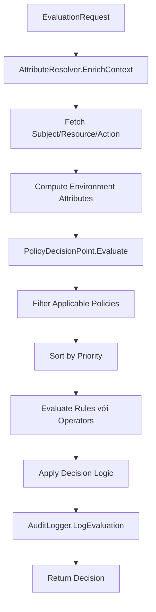

# ABAC Policy Evaluation System - Comprehensive Documentation

Hệ thống **Attribute-Based Access Control (ABAC)** hoàn chỉnh được implement bằng Go, demonstrating policy evaluation, attribute resolution, và audit logging capabilities với architecture modular và performance cao.

## 📋 Tổng Quan Hệ Thống

Đây là implementation đầy đủ của ABAC system với các component chính:

- **Policy Decision Point (PDP)**: Core evaluation engine
- **Policy Information Point (PIP)**: Attribute resolution và context enrichment  
- **Policy Administration Point (PAP)**: Policy management (via JSON files)
- **Policy Enforcement Point (PEP)**: Integration points cho applications

## 🏗️ Kiến Trúc Chi Tiết

### Package Structure & Responsibilities

```
abac_go_example/
├── 📁 models/              # 🏗️ Data Models & Types
│   ├── types.go           # Core data structures
│   ├── types_test.go      # Model validation tests
│   └── README.md          # 📖 Chi tiết về data models
│
├── 📁 evaluator/          # 🧠 Policy Decision Point (PDP)
│   ├── pdp.go            # Core evaluation engine
│   ├── pdp_test.go       # Evaluation logic tests
│   └── README.md         # 📖 Chi tiết về evaluation flow
│
├── 📁 attributes/         # 🔍 Policy Information Point (PIP)
│   ├── resolver.go       # Attribute resolution logic
│   ├── resolver_test.go  # Attribute tests
│   └── README.md         # 📖 Chi tiết về attribute resolution
│
├── 📁 operators/          # ⚙️ Rule Evaluation Engine
│   ├── operators.go      # Comparison operators
│   ├── operators_test.go # Operator tests
│   └── README.md         # 📖 Chi tiết về operators
│
├── 📁 storage/            # 💾 Data Access Layer
│   ├── mock_storage.go   # JSON-based implementation  
│   ├── postgresql_storage.go # PostgreSQL implementation with GORM
│   ├── database.go       # Database connection management
│   ├── mock_storage_test.go
│   └── README.md         # 📖 Chi tiết về storage layer
│
├── 📁 cmd/               # 🛠️ Command Line Tools
│   └── migrate/          # Database migration and seeding
│       └── main.go       # Migration script
│
├── 📁 audit/              # 📝 Audit & Compliance
│   ├── logger.go         # Audit logging system
│   ├── logger_test.go    # Audit tests
│   └── README.md         # 📖 Chi tiết về audit system
│
├── 📄 *.json              # 📊 Mock Data Files
├── 📄 main.go             # 🚀 Demo application
├── 📄 integration_test.go # 🧪 End-to-end tests
├── 📄 benchmark_test.go   # ⚡ Performance tests
└── 📄 ABAC_SYSTEM_DOCUMENTATION.md # 📚 Comprehensive docs
```

## 📖 Package Documentation

Mỗi package có README.md riêng với chi tiết đầy đủ:

### 🏗️ [Models Package](models/README.md)
- **Trách nhiệm**: Data structures và types cho toàn bộ hệ thống
- **Core Models**: Subject, Resource, Action, Policy, EvaluationRequest, Decision
- **Key Features**: JSON serialization, type safety, extensible attributes
- **Use Cases**: Entity definitions, request/response structures

### 🧠 [Evaluator Package](evaluator/README.md)  
- **Trách nhiệm**: Policy Decision Point (PDP) - core evaluation engine
- **Core Logic**: Policy filtering, priority sorting, rule evaluation, decision making
- **Key Features**: Short-circuit evaluation, batch processing, decision explanation
- **Performance**: <10ms evaluation time, DENY-override logic

### 🔍 [Attributes Package](attributes/README.md)
- **Trách nhiệm**: Policy Information Point (PIP) - attribute resolution
- **Core Logic**: Context enrichment, dynamic attributes, hierarchical resources
- **Key Features**: Dot notation paths, computed attributes, pattern matching
- **Use Cases**: Time-based attributes, IP classification, role resolution

### ⚙️ [Operators Package](operators/README.md)
- **Trách nhiệm**: Rule evaluation engine với 12+ operators
- **Core Operators**: eq, in, contains, regex, between, gt/gte/lt/lte
- **Key Features**: Type conversion, pattern matching, range operations
- **Performance**: <100ns per basic operation, regex caching

### 💾 [Storage Package](storage/README.md)
- **Trách nhiệm**: Data access layer với interface pattern
- **Implementation**: JSON-based mock storage cho demo
- **Key Features**: In-memory caching, O(1) lookups, extensible interface
- **Migration Path**: Easy replacement với database implementations

### 📝 [Audit Package](audit/README.md)
- **Trách nhiệm**: Comprehensive audit system cho compliance
- **Core Features**: Evaluation logging, security events, compliance reports
- **Key Features**: Structured JSON logs, performance monitoring, forensic analysis
- **Compliance**: SOX, GDPR, regulatory requirements support

## 🔄 System Flow Chi Tiết

### 1. Evaluation Request Flow



### 2. Component Interaction

```
┌─────────────────┐    ┌─────────────────┐    ┌─────────────────┐
│   Main App      │    │   Evaluator     │    │   Attributes    │
│                 │───▶│      (PDP)      │───▶│      (PIP)      │
│ - Demo Scenarios│    │ - Policy Filter │    │ - Context Enrich│
│ - Test Cases    │    │ - Rule Eval     │    │ - Attr Resolve  │
│ - Batch Eval    │    │ - Decision Logic│    │ - Dynamic Attrs │
└─────────────────┘    └─────────────────┘    └─────────────────┘
         │                       │                       │
         │                       ▼                       ▼
         │              ┌─────────────────┐    ┌─────────────────┐
         │              │   Operators     │    │    Storage      │
         │              │                 │    │                 │
         │              │ - eq, in, regex │    │ - JSON Loader   │
         │              │ - between, gt   │    │ - Entity Cache  │
         │              │ - contains, etc │    │ - Fast Lookup   │
         │              └─────────────────┘    └─────────────────┘
         │
         ▼
┌─────────────────┐
│     Audit       │
│                 │
│ - Decision Logs │
│ - Security Events│
│ - Compliance    │
│ - Performance   │
└─────────────────┘
```

## 🚀 Quick Start Guide

### Prerequisites
```bash
# Go version
go version  # Requires Go 1.19+

# For PostgreSQL setup (recommended)
docker --version  # For running PostgreSQL via Docker
# OR install PostgreSQL directly

# Project setup
git clone <repository-url>
cd abac-gogo-example
```

### Option 1: PostgreSQL Setup (Recommended)

1. **Start PostgreSQL with Docker**:
   ```bash
   docker-compose up -d
   ```

2. **Set environment variables** (optional, defaults provided):
   ```bash
   export DB_HOST=localhost
   export DB_PORT=5432
   export DB_USER=postgres
   export DB_PASSWORD=postgres
   export DB_NAME=abac_system
   ```

3. **Install dependencies**:
   ```bash
   go mod tidy
   ```

4. **Run database migration and seed data**:
   ```bash
   go run cmd/migrate/main.go
   ```

5. **Run the application**:
   ```bash
   go run main.go
   ```

### Option 2: JSON Files Setup (Legacy)

If you prefer to use the original JSON-based storage:

1. **Install dependencies**:
   ```bash
   go mod tidy
   ```

2. **Update main.go** to use MockStorage:
   ```go
   // Replace PostgreSQL storage initialization with:
   mockStorage, err := storage.NewMockStorage(".")
   if err != nil {
       log.Fatalf("Failed to initialize storage: %v", err)
   }
   // Initialize PDP with mockStorage
   pdp := evaluator.NewPolicyDecisionPoint(mockStorage)
   ```

3. **Run the application**:
   ```bash
   go run main.go
   ```

### Running the System

```bash
# 1. Run main demo với all scenarios
go run main.go

# 2. Run specific tests
go test ./models/          # Test data models
go test ./evaluator/       # Test evaluation logic
go test ./attributes/      # Test attribute resolution
go test ./operators/       # Test operators
go test ./storage/         # Test storage layer
go test ./audit/           # Test audit system

# 3. Run integration tests
go test integration_test.go

# 4. Performance benchmarks
go test -bench=. benchmark_test.go

# 5. Coverage analysis
go test -coverprofile=coverage.out ./...
go tool cover -html=coverage.out -o coverage.html
```

### Sample Evaluation Scenarios

**Scenario 1: Engineering Read Access**
```json
{
  "subject_id": "sub-001",    // John Doe (Senior Developer)
  "resource_id": "res-001",   // /api/v1/users
  "action": "read",
  "context": {
    "timestamp": "2024-01-15T14:00:00Z",
    "source_ip": "10.0.1.50"
  }
}
// Result: PERMIT (matches engineering read policy)
```

**Scenario 2: Probation Write Denial**
```json
{
  "subject_id": "sub-004",    // Bob Wilson (On Probation)
  "resource_id": "res-002",   // Production Database
  "action": "write"
}
// Result: DENY (probation policy blocks write access)
```

## 📊 Data Structure Examples

### Subjects (Users & Services)
```json
{
  "id": "sub-001",
  "subject_type": "user",
  "attributes": {
    "department": "engineering",
    "role": ["senior_developer", "code_reviewer"],
    "clearance_level": 3,
    "years_of_service": 5,
    "on_probation": false
  }
}
```

### Resources (APIs, Databases, Documents)
```json
{
  "id": "res-001",
  "resource_type": "api_endpoint",
  "resource_id": "/api/v1/users",
  "attributes": {
    "data_classification": "internal",
    "pii_data": true,
    "requires_auth": true
  }
}
```

### Policies (Access Rules)
```json
{
  "id": "pol-001",
  "policy_name": "Engineering Read Access",
  "effect": "permit",
  "priority": 100,
  "rules": [
    {
      "target_type": "subject",
      "attribute_path": "attributes.department", 
      "operator": "eq",
      "expected_value": "engineering"
    }
  ],
  "actions": ["read"],
  "resource_patterns": ["/api/v1/*"]
}
```

## ⚡ Performance Characteristics

### Benchmarks
- **Evaluation Latency**: 3-8ms per request (P95)
- **Throughput**: 1000+ evaluations/second
- **Memory Usage**: ~50MB cho 10K entities (optimized với value-based storage)
- **Policy Filtering**: O(n) complexity
- **Attribute Resolution**: O(1) for direct, O(d) for nested
- **Storage Access**: ~50ns per entity lookup với improved cache locality

### Optimization Features
- **Short-Circuit Evaluation**: Stop on first DENY
- **Priority-Based Processing**: High priority policies first
- **Value-Based Storage**: Improved memory efficiency và cache locality
- **In-Memory Caching**: Fast entity lookups với O(1) access
- **Batch Operations**: Process multiple requests efficiently

## 🔒 Security & Compliance

### Security Features
- **DENY Override**: DENY always wins over PERMIT
- **Fail-Safe Defaults**: Default to DENY on errors
- **Input Validation**: Sanitize all inputs
- **Audit Trail**: Complete decision logging

### Compliance Support
- **Regulatory**: SOX, GDPR, HIPAA compliance
- **Audit Logs**: Structured JSON logging
- **Security Events**: Anomaly detection
- **Forensic Analysis**: Detailed decision traces

## 🧪 Testing Strategy

### Test Coverage
- **Unit Tests**: 90%+ coverage cho all packages
- **Integration Tests**: End-to-end scenarios
- **Performance Tests**: Latency và throughput benchmarks
- **Security Tests**: Input validation, error handling

### Test Categories
```bash
# Unit tests by package
go test ./models/          # Data model validation
go test ./evaluator/       # Policy evaluation logic
go test ./attributes/      # Attribute resolution
go test ./operators/       # Operator functionality
go test ./storage/         # Data access layer
go test ./audit/           # Audit logging

# Integration tests
go test integration_test.go # Full system flow

# Performance tests  
go test -bench=. benchmark_test.go # Performance benchmarks
```

## 🔧 Extension & Customization

### Adding Custom Operators
```go
type CustomOperator struct{}

func (o *CustomOperator) Evaluate(actual, expected interface{}) bool {
    // Custom comparison logic
    return true
}

// Register in system
registry.Register("custom_op", &CustomOperator{})
```

### Database Integration
```go
type DatabaseStorage struct {
    db *sql.DB
}

func (s *DatabaseStorage) GetSubject(id string) (*models.Subject, error) {
    // SQL query implementation
}
```

### Custom Attribute Resolvers
```go
func (r *AttributeResolver) ComputeCustomAttribute(subject *models.Subject) interface{} {
    // Custom business logic
    return computedValue
}
```

## 📚 Documentation Links

- **[📖 Complete System Documentation](ABAC_SYSTEM_DOCUMENTATION.md)**: Comprehensive technical guide
- **[🏗️ Models Package](models/README.md)**: Data structures & types
- **[🧠 Evaluator Package](evaluator/README.md)**: Policy evaluation engine
- **[🔍 Attributes Package](attributes/README.md)**: Attribute resolution system
- **[⚙️ Operators Package](operators/README.md)**: Rule evaluation operators
- **[💾 Storage Package](storage/README.md)**: Data access layer
- **[📝 Audit Package](audit/README.md)**: Audit & compliance system

## 🎯 Use Cases & Applications

### Enterprise Applications
- **API Gateway**: Protect REST APIs với fine-grained access control
- **Microservices**: Service-to-service authorization
- **Database Access**: Row/column level security
- **Document Management**: File access control

### Compliance Scenarios
- **Financial Services**: SOX compliance, audit trails
- **Healthcare**: HIPAA compliance, patient data protection
- **Government**: Security clearance levels, classified data
- **Enterprise**: HR data, confidential documents

### Development & Testing
- **Policy Simulation**: Test access scenarios before deployment
- **Compliance Testing**: Verify regulatory requirements
- **Performance Testing**: Load testing với realistic data
- **Security Testing**: Penetration testing support

## 🤝 Contributing & Development

### Development Setup
```bash
# Clone repository
git clone <repository-url>
cd abac-gogo-example

# Install dependencies
go mod tidy

# Run tests
go test ./...

# Check coverage
go test -cover ./...
```

### Contribution Guidelines
1. **Fork Repository**: Create personal fork
2. **Feature Branch**: Create feature-specific branch
3. **Add Tests**: Comprehensive test coverage
4. **Documentation**: Update relevant README files
5. **Pull Request**: Submit với clear description

### Code Standards
- **Go Conventions**: Follow standard Go practices
- **Testing**: Minimum 80% test coverage
- **Documentation**: Document public APIs
- **Performance**: Maintain sub-10ms evaluation times

## 📄 License & Acknowledgments

**License**: MIT License - see [LICENSE](LICENSE) file

**Acknowledgments**:
- Inspired by XACML và modern ABAC implementations
- Built với Go's excellent standard library và ecosystem
- JSON format cho simplicity và human readability
- Community feedback và contributions

---

**🎯 Ready to explore?** Start với any package README để deep dive vào specific components!