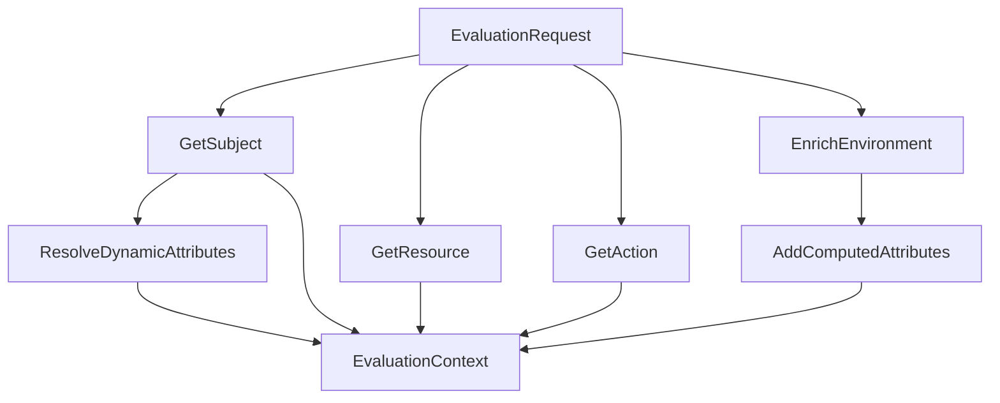

# Attributes Package - Policy Information Point (PIP)

## 📋 Tổng Quan

Package `attributes` implement **Policy Information Point (PIP)** - component chịu trách nhiệm resolve và enrich attributes từ các nguồn khác nhau. Đây là layer quan trọng transform raw evaluation request thành rich context với đầy đủ thông tin cần thiết cho policy evaluation. **Updated để support PostgreSQL JSONB data types.**

## 🎯 Trách Nhiệm Chính

1. **Context Enrichment**: Transform EvaluationRequest thành EvaluationContext
2. **Attribute Resolution**: Resolve nested attributes với dot notation
3. **JSONB Support**: Handle PostgreSQL JSONB custom types (JSONMap, JSONStringSlice)
4. **Dynamic Computation**: Calculate derived attributes (years_of_service, time_of_day)
5. **Environment Enhancement**: Add computed environment attributes
6. **Hierarchical Processing**: Handle resource hierarchy và inheritance
7. **Pattern Matching**: Support wildcard patterns cho resource matching

## 📁 Cấu Trúc Files

```
attributes/
├── resolver.go          # AttributeResolver implementation
└── resolver_test.go     # Unit tests cho resolver
```

## 🏗️ Core Architecture

### AttributeResolver Struct

```go
type AttributeResolver struct {
    storage storage.Storage    // Access to data layer
}
```

**Dependencies:**
- **Storage**: Access subjects, resources, actions từ data layer (PostgreSQL hoặc Mock)

## 🔄 Attribute Resolution Flow

### 1. Main Enrichment Method

```go
func (r *AttributeResolver) EnrichContext(request *models.EvaluationRequest) (*models.EvaluationContext, error)
```

**Flow Diagram:**


**Step-by-Step Process:**

#### Step 1: Entity Resolution
```go
// Get subject from storage (PostgreSQL hoặc Mock)
subject, err := r.storage.GetSubject(request.SubjectID)
if err != nil {
    return nil, fmt.Errorf("failed to get subject: %w", err)
}

// Get resource from storage  
resource, err := r.storage.GetResource(request.ResourceID)
if err != nil {
    return nil, fmt.Errorf("failed to get resource: %w", err)
}

// Get action from storage
action, err := r.storage.GetAction(request.Action)
if err != nil {
    return nil, fmt.Errorf("failed to get action: %w", err)
}
```

**PostgreSQL vs Mock Storage:**
- **PostgreSQL**: GORM queries với JSONB data types
- **Mock**: In-memory map lookups với JSON data

#### Step 2: Environment Enrichment
```go
environment := r.enrichEnvironmentContext(request.Context)
```

**Input Context:**
```json
{
  "timestamp": "2024-01-15T14:00:00Z",
  "source_ip": "10.0.1.50",
  "user_agent": "Mozilla/5.0..."
}
```

**Enriched Environment:**
```json
{
  "timestamp": "2024-01-15T14:00:00Z",
  "source_ip": "10.0.1.50", 
  "user_agent": "Mozilla/5.0...",
  "time_of_day": "14:00",
  "day_of_week": "monday",
  "hour": 14,
  "is_business_hours": true,
  "is_internal_ip": true,
  "ip_subnet": "10.0.1.0/24"
}
```

#### Step 3: Dynamic Subject Attributes
```go
r.resolveDynamicAttributes(subject, environment)
```

**Computed Attributes:**
```go
// Calculate years_of_service từ hire_date
if hireDateStr, ok := subject.Attributes["hire_date"].(string); ok {
    if hireDate, err := time.Parse("2006-01-02", hireDateStr); err == nil {
        years := time.Since(hireDate).Hours() / (24 * 365.25)
        subject.Attributes["years_of_service"] = int(years)
    }
}

// Add current time attributes
now := time.Now()
subject.Attributes["current_hour"] = now.Hour()
subject.Attributes["current_day"] = strings.ToLower(now.Weekday().String())
```

## 🔍 Environment Enrichment Chi Tiết

### 1. Time-Based Attributes

```go
func (r *AttributeResolver) enrichEnvironmentContext(context map[string]interface{}) map[string]interface{}
```

**Time Processing:**
```go
// Extract time_of_day từ timestamp
if timestampStr, ok := enriched["timestamp"].(string); ok {
    if t, err := time.Parse(time.RFC3339, timestampStr); err == nil {
        enriched["time_of_day"] = t.Format("15:04")        // "14:00"
        enriched["day_of_week"] = strings.ToLower(t.Weekday().String()) // "monday"
        enriched["hour"] = t.Hour()                        // 14
        enriched["is_business_hours"] = r.isBusinessHours(t) // true/false
    }
}
```

**Business Hours Logic:**
```go
func (r *AttributeResolver) isBusinessHours(t time.Time) bool {
    hour := t.Hour()
    weekday := t.Weekday()
    
    // Business hours: 8 AM to 6 PM, Monday to Friday
    return weekday >= time.Monday && weekday <= time.Friday && hour >= 8 && hour < 18
}
```

### 2. IP-Based Attributes

```go
// Add derived IP attributes
if sourceIP, ok := enriched["source_ip"].(string); ok {
    enriched["is_internal_ip"] = r.isInternalIP(sourceIP)
    enriched["ip_subnet"] = r.getIPSubnet(sourceIP)
}
```

**IP Classification:**
```go
func (r *AttributeResolver) isInternalIP(ip string) bool {
    // Check for private IP ranges
    return strings.HasPrefix(ip, "10.") ||
        strings.HasPrefix(ip, "192.168.") ||
        strings.HasPrefix(ip, "172.16.") ||
        ip == "127.0.0.1" ||
        ip == "localhost"
}

func (r *AttributeResolver) getIPSubnet(ip string) string {
    parts := strings.Split(ip, ".")
    if len(parts) >= 3 {
        return strings.Join(parts[:3], ".") + ".0/24"
    }
    return ip
}
```

**IP Examples:**
- `10.0.1.50` → `is_internal_ip: true`, `ip_subnet: "10.0.1.0/24"`
- `203.0.113.1` → `is_internal_ip: false`, `ip_subnet: "203.0.113.0/24"`

## 🔧 Attribute Value Resolution với JSONB Support

### 1. Dot Notation Path Resolution (Updated for JSONB)

```go
func (r *AttributeResolver) GetAttributeValue(target interface{}, path string) interface{}
```

**Path Examples:**
- `attributes.department` → Access nested map (JSONB hoặc map[string]interface{})
- `subject_type` → Direct field access
- `metadata.full_name` → Nested metadata access

**JSONB Type Handling:**
```go
func (r *AttributeResolver) getFieldValue(obj interface{}, field string) interface{} {
    if obj == nil {
        return nil
    }

    // Handle map access
    if m, ok := obj.(map[string]interface{}); ok {
        return m[field]
    }

    // Handle JSONMap custom type (convert to map[string]interface{})
    if jsonMap, ok := obj.(models.JSONMap); ok {
        return map[string]interface{}(jsonMap)[field]
    }

    // Handle struct access using reflection
    // ... reflection logic
}
```

**Implementation:**
```go
parts := strings.Split(path, ".")
current := target

for _, part := range parts {
    current = r.getFieldValue(current, part)
    if current == nil {
        return nil
    }
}

return current
```

### 2. Field Value Extraction

```go
func (r *AttributeResolver) getFieldValue(obj interface{}, field string) interface{}
```

**Map Access:**
```go
if m, ok := obj.(map[string]interface{}); ok {
    return m[field]
}
```

**Struct Access với Reflection:**
```go
v := reflect.ValueOf(obj)
if v.Kind() == reflect.Ptr {
    v = v.Elem()
}

// Try to find field by name (case-insensitive)
t := v.Type()
for i := 0; i < v.NumField(); i++ {
    fieldType := t.Field(i)
    
    // Check JSON tag
    if jsonTag := fieldType.Tag.Get("json"); jsonTag != "" {
        tagName := strings.Split(jsonTag, ",")[0]
        if tagName == field {
            return v.Field(i).Interface()
        }
    }
    
    // Check field name
    if strings.EqualFold(fieldType.Name, field) {
        return v.Field(i).Interface()
    }
}
```

### 3. Attribute Resolution Examples với JSONB

**Subject Attribute Access (PostgreSQL JSONB):**
```go
// Input: subject object với JSONB attributes, path: "attributes.department"
subject := &models.Subject{
    Attributes: models.JSONMap{
        "department": "engineering",
        "role": []interface{}{"senior_developer", "code_reviewer"},
    },
}

// Resolution process:
// 1. Split path: ["attributes", "department"]
// 2. Access subject.Attributes → models.JSONMap (JSONB type)
// 3. Convert JSONMap to map[string]interface{}
// 4. Access map["department"] → "engineering"
// Result: "engineering"
```

**Mock Storage Attribute Access:**
```go
// Input: subject object với regular map, path: "attributes.department"
subject := &models.Subject{
    Attributes: map[string]interface{}{
        "department": "engineering",
        "role": ["senior_developer", "code_reviewer"],
    },
}

// Resolution process:
// 1. Split path: ["attributes", "department"]
// 2. Access subject.Attributes → map[string]interface{}
// 3. Access map["department"] → "engineering"
// Result: "engineering"
```

**Environment Attribute Access:**
```go
// Input: environment map, path: "time_of_day"
environment := map[string]interface{}{
    "time_of_day": "14:00",
    "is_business_hours": true,
}

// Resolution process:
// 1. Split path: ["time_of_day"]
// 2. Access map["time_of_day"] → "14:00"
// Result: "14:00"
```

## 🌳 Hierarchical Resource Processing

### 1. Resource Hierarchy Resolution

```go
func (r *AttributeResolver) ResolveHierarchy(resourcePath string) []string
```

**Path Processing:**
```go
// Input: "/api/v1/users/123"
parts := strings.Split(strings.Trim(resourcePath, "/"), "/")
hierarchy := make([]string, 0, len(parts))

current := ""
for _, part := range parts {
    if part == "" {
        continue
    }
    current += "/" + part
    hierarchy = append(hierarchy, current)
}

// Result: ["/api", "/api/v1", "/api/v1/users", "/api/v1/users/123"]
```

**Wildcard Expansion:**
```go
// Add wildcard patterns
wildcardHierarchy := make([]string, 0, len(hierarchy)*2)
for _, path := range hierarchy {
    wildcardHierarchy = append(wildcardHierarchy, path)
    wildcardHierarchy = append(wildcardHierarchy, path+"/*")
}

// Final result: [
//   "/api", "/api/*",
//   "/api/v1", "/api/v1/*", 
//   "/api/v1/users", "/api/v1/users/*",
//   "/api/v1/users/123", "/api/v1/users/123/*"
// ]
```

### 2. Resource Pattern Matching

```go
func (r *AttributeResolver) MatchResourcePattern(pattern, resource string) bool
```

**Pattern Types:**

1. **Exact Match:**
   ```go
   pattern == resource
   // "/api/v1/users" matches "/api/v1/users"
   ```

2. **Wildcard Match:**
   ```go
   pattern == "*"
   // "*" matches anything
   ```

3. **Prefix Wildcard:**
   ```go
   pattern = "/api/v1/*"
   resource = "/api/v1/users"
   // Match: resource starts with "/api/v1/"
   ```

**Implementation:**
```go
func (r *AttributeResolver) MatchResourcePattern(pattern, resource string) bool {
    if pattern == "*" {
        return true
    }
    
    if pattern == resource {
        return true
    }
    
    // Handle wildcard patterns
    if strings.Contains(pattern, "*") {
        return r.simpleWildcardMatch(pattern, resource)
    }
    
    return false
}
```

**Wildcard Matching Logic:**
```go
func (r *AttributeResolver) simpleWildcardMatch(pattern, str string) bool {
    parts := strings.Split(pattern, "*")
    
    // Check if string starts with first part
    if parts[0] != "" && !strings.HasPrefix(str, parts[0]) {
        return false
    }
    
    // Check if string ends with last part  
    if parts[len(parts)-1] != "" && !strings.HasSuffix(str, parts[len(parts)-1]) {
        return false
    }
    
    return true
}
```

## 🧮 Dynamic Attribute Computation

### 1. Time-Based Computations

**Years of Service:**
```go
if hireDateStr, ok := subject.Attributes["hire_date"].(string); ok {
    if hireDate, err := time.Parse("2006-01-02", hireDateStr); err == nil {
        years := time.Since(hireDate).Hours() / (24 * 365.25)
        subject.Attributes["years_of_service"] = int(years)
    }
}
```

**Current Time Attributes:**
```go
now := time.Now()
subject.Attributes["current_hour"] = now.Hour()
subject.Attributes["current_day"] = strings.ToLower(now.Weekday().String())
```

### 2. Derived Environment Attributes

**Business Hours Check:**
```go
enriched["is_business_hours"] = r.isBusinessHours(t)
```

**IP Classification:**
```go
enriched["is_internal_ip"] = r.isInternalIP(sourceIP)
enriched["ip_subnet"] = r.getIPSubnet(sourceIP)
```

**Time Extraction:**
```go
enriched["time_of_day"] = t.Format("15:04")
enriched["day_of_week"] = strings.ToLower(t.Weekday().String())
enriched["hour"] = t.Hour()
```

## 🔍 Attribute Resolution Examples

### Example 1: User Subject Resolution

**Input Subject:**
```json
{
  "id": "sub-001",
  "subject_type": "user",
  "attributes": {
    "department": "engineering",
    "role": ["senior_developer", "code_reviewer"],
    "hire_date": "2020-01-15",
    "clearance_level": 3
  }
}
```

**After Dynamic Resolution:**
```json
{
  "id": "sub-001", 
  "subject_type": "user",
  "attributes": {
    "department": "engineering",
    "role": ["senior_developer", "code_reviewer"],
    "hire_date": "2020-01-15",
    "clearance_level": 3,
    "years_of_service": 4,        // Computed
    "current_hour": 14,           // Computed
    "current_day": "monday"       // Computed
  }
}
```

### Example 2: Environment Context Enrichment

**Input Context:**
```json
{
  "timestamp": "2024-01-15T14:30:00Z",
  "source_ip": "10.0.1.50",
  "user_agent": "Mozilla/5.0 (Macintosh; Intel Mac OS X 10_15_7)"
}
```

**Enriched Context:**
```json
{
  "timestamp": "2024-01-15T14:30:00Z",
  "source_ip": "10.0.1.50",
  "user_agent": "Mozilla/5.0 (Macintosh; Intel Mac OS X 10_15_7)",
  "time_of_day": "14:30",        // Derived
  "day_of_week": "monday",       // Derived  
  "hour": 14,                    // Derived
  "is_business_hours": true,     // Computed
  "is_internal_ip": true,        // Computed
  "ip_subnet": "10.0.1.0/24"     // Computed
}
```

### Example 3: Resource Pattern Matching

**Resource Patterns:**
```json
{
  "patterns": ["/api/v1/*", "/docs/technical/*", "DOC-*-FINANCE"],
  "test_resources": [
    "/api/v1/users",           // ✅ Matches "/api/v1/*"
    "/api/v1/orders/123",      // ✅ Matches "/api/v1/*"  
    "/docs/technical/setup",   // ✅ Matches "/docs/technical/*"
    "DOC-2024-Q1-FINANCE",     // ✅ Matches "DOC-*-FINANCE"
    "/api/v2/users",           // ❌ No match
    "/public/docs"             // ❌ No match
  ]
}
```

## ⚡ Performance Optimizations

### 1. Attribute Caching
```go
// Cache resolved attributes trong request lifecycle
type AttributeCache struct {
    subjectAttrs map[string]interface{}
    resourceAttrs map[string]interface{}
    envAttrs map[string]interface{}
}
```

### 2. Lazy Evaluation
```go
// Chỉ resolve attributes khi cần thiết
func (r *AttributeResolver) GetAttributeValueLazy(target interface{}, path string) interface{} {
    // Check cache first
    if cached, exists := r.cache[path]; exists {
        return cached
    }
    
    // Resolve và cache
    value := r.GetAttributeValue(target, path)
    r.cache[path] = value
    return value
}
```

### 3. Batch Processing
```go
// Resolve multiple attributes cùng lúc
func (r *AttributeResolver) GetMultipleAttributes(target interface{}, paths []string) map[string]interface{} {
    results := make(map[string]interface{})
    for _, path := range paths {
        results[path] = r.GetAttributeValue(target, path)
    }
    return results
}
```

## 🧪 Testing Strategies

### Unit Tests với JSONB Support
```go
func TestAttributeResolution(t *testing.T) {
    resolver := attributes.NewAttributeResolver(mockStorage) // mockStorage uses values for efficiency
    
    // Test với PostgreSQL JSONB type
    subject := &models.Subject{
        Attributes: models.JSONMap{
            "department": "engineering",
        },
    }
    
    value := resolver.GetAttributeValue(subject, "attributes.department")
    assert.Equal(t, "engineering", value)
    
    // Test với Mock storage map type
    subjectMock := &models.Subject{
        Attributes: map[string]interface{}{
            "department": "engineering",
        },
    }
    
    valueMock := resolver.GetAttributeValue(subjectMock, "attributes.department")
    assert.Equal(t, "engineering", valueMock)
}
```

### Integration Tests
```go
func TestContextEnrichment(t *testing.T) {
    request := &models.EvaluationRequest{
        SubjectID: "sub-001",
        Context: map[string]interface{}{
            "timestamp": "2024-01-15T14:00:00Z",
        },
    }
    
    context, err := resolver.EnrichContext(request)
    assert.NoError(t, err)
    assert.Equal(t, "14:00", context.Environment["time_of_day"])
}
```

### Performance Tests
```go
func BenchmarkAttributeResolution(b *testing.B) {
    for i := 0; i < b.N; i++ {
        resolver.GetAttributeValue(subject, "attributes.department")
    }
    // Target: < 1ms per resolution
}
```

## 🔒 Security Considerations

### 1. Input Validation
```go
func (r *AttributeResolver) validatePath(path string) error {
    if path == "" {
        return fmt.Errorf("empty attribute path")
    }
    
    // Prevent path traversal
    if strings.Contains(path, "..") {
        return fmt.Errorf("invalid path: contains '..'")
    }
    
    return nil
}
```

### 2. Safe Type Conversion
```go
func (r *AttributeResolver) safeTypeConversion(value interface{}) interface{} {
    // Handle nil values
    if value == nil {
        return nil
    }
    
    // Sanitize string values
    if str, ok := value.(string); ok {
        return strings.TrimSpace(str)
    }
    
    return value
}
```

### 3. Attribute Sanitization
```go
func (r *AttributeResolver) sanitizeAttributes(attrs map[string]interface{}) {
    for key, value := range attrs {
        // Remove sensitive attributes
        if strings.Contains(strings.ToLower(key), "password") ||
           strings.Contains(strings.ToLower(key), "secret") {
            delete(attrs, key)
        }
        
        // Sanitize values
        attrs[key] = r.safeTypeConversion(value)
    }
}
```

## 📊 Monitoring & Metrics

### Key Metrics
- **Resolution Latency**: Time to resolve attributes
- **Cache Hit Rate**: Percentage of cached attribute access
- **Error Rate**: Failed attribute resolutions
- **Memory Usage**: Attribute cache memory consumption

### Performance Targets
- **Resolution Time**: < 1ms per attribute
- **Cache Hit Rate**: > 80%
- **Memory Efficiency**: < 100MB cache size
- **Error Rate**: < 0.1%

## 🎯 Best Practices

1. **Attribute Naming**: Use consistent naming conventions
2. **Type Safety**: Validate attribute types before use
3. **Caching**: Cache frequently accessed attributes
4. **Error Handling**: Graceful handling of missing attributes
5. **Performance**: Optimize hot paths với lazy loading
6. **Security**: Sanitize và validate all inputs

Package `attributes` là critical component cung cấp rich context cho policy evaluation, đảm bảo PDP có đầy đủ thông tin để đưa ra quyết định chính xác.
