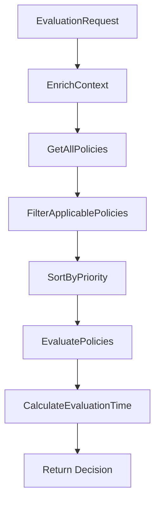

# Evaluator Package - Policy Decision Point (PDP)

## 📋 Tổng Quan

Package `evaluator` chứa **Policy Decision Point (PDP)** - core engine của hệ thống ABAC. Đây là component chính thực hiện policy evaluation và đưa ra quyết định access control dựa trên attributes của subject, resource, action và environment context.

## 🎯 Trách Nhiệm Chính

1. **Policy Evaluation**: Evaluate access requests dựa trên defined policies
2. **Decision Making**: Đưa ra quyết định PERMIT/DENY/NOT_APPLICABLE
3. **Rule Processing**: Xử lý complex rule logic với multiple conditions
4. **Priority Management**: Handle policy priorities và conflict resolution
5. **Performance Optimization**: Fast evaluation với short-circuit logic
6. **Batch Processing**: Support batch evaluation cho multiple requests

## 📁 Cấu Trúc Files

```
evaluator/
├── pdp.go          # Policy Decision Point implementation
└── pdp_test.go     # Unit tests cho PDP
```

## 🏗️ Core Architecture

### PolicyDecisionPoint Struct

```go
type PolicyDecisionPoint struct {
    storage           storage.Storage              // Data access layer
    attributeResolver *attributes.AttributeResolver // Attribute resolution
    operatorRegistry  *operators.OperatorRegistry  // Rule operators
}
```

**Dependencies:**
- **Storage**: Access policies, subjects, resources, actions
- **AttributeResolver**: Enrich context với full attributes
- **OperatorRegistry**: Evaluate rule conditions

## 🔄 Evaluation Flow Chi Tiết

### 1. Main Evaluation Method

```go
func (pdp *PolicyDecisionPoint) Evaluate(request *models.EvaluationRequest) (*models.Decision, error)
```

**Flow Steps:**



**Step-by-Step Process:**

#### Step 1: Context Enrichment
```go
context, err := pdp.attributeResolver.EnrichContext(request)
```

**Input**: Basic EvaluationRequest
```json
{
  "request_id": "eval-001",
  "subject_id": "sub-001", 
  "resource_id": "res-001",
  "action": "read",
  "context": {
    "timestamp": "2024-01-15T14:00:00Z",
    "source_ip": "10.0.1.50"
  }
}
```

**Output**: Rich EvaluationContext
```go
type EvaluationContext struct {
    Subject     *Subject    // Full subject với attributes
    Resource    *Resource   // Full resource với attributes  
    Action      *Action     // Full action object
    Environment map[string]interface{} // Enriched environment
    Timestamp   time.Time   // Evaluation timestamp
}
```

#### Step 2: Policy Retrieval
```go
allPolicies, err := pdp.storage.GetPolicies()
```

Load tất cả policies từ storage (JSON files trong demo).

#### Step 3: Policy Filtering
```go
applicablePolicies := pdp.filterApplicablePolicies(allPolicies, context)
```

**Filtering Logic:**

1. **Enabled Check**:
   ```go
   if !policy.Enabled {
       continue // Skip disabled policies
   }
   ```

2. **Action Matching**:
   ```go
   func (pdp *PolicyDecisionPoint) actionMatches(policyActions []string, requestedAction string) bool {
       if len(policyActions) == 0 {
           return true // No action restriction
       }
       
       for _, action := range policyActions {
           if action == "*" || action == requestedAction {
               return true
           }
       }
       return false
   }
   ```

3. **Resource Pattern Matching**:
   ```go
   func (pdp *PolicyDecisionPoint) resourcePatternMatches(patterns []string, resource *Resource) bool {
       for _, pattern := range patterns {
           if pdp.attributeResolver.MatchResourcePattern(pattern, resourcePath) {
               return true
           }
       }
       return false
   }
   ```

**Pattern Examples:**
- `*` → matches all resources
- `/api/v1/*` → matches `/api/v1/users`, `/api/v1/orders`
- `DOC-*-FINANCE` → matches `DOC-2024-Q1-FINANCE`

#### Step 4: Priority Sorting
```go
sort.Slice(applicablePolicies, func(i, j int) bool {
    return applicablePolicies[i].Priority < applicablePolicies[j].Priority
})
```

**Priority Rules:**
- **Lower number = Higher priority**
- Priority 1-10: Critical security policies (DENY)
- Priority 11-50: Role-based access policies
- Priority 51-100: Department-level policies
- Priority 101+: Default/fallback policies

#### Step 5: Policy Evaluation với Short-Circuit
```go
decision := pdp.evaluatePolicies(applicablePolicies, context)
```

**Short-Circuit Logic:**
```go
for _, policy := range policies {
    if pdp.evaluatePolicy(policy, context) {
        matchedPolicies = append(matchedPolicies, policy.ID)
        
        if policy.Effect == "deny" {
            // DENY overrides everything - short circuit
            return &models.Decision{
                Result: "deny",
                MatchedPolicies: matchedPolicies,
                Reason: fmt.Sprintf("Denied by policy: %s", policy.PolicyName),
            }
        } else if policy.Effect == "permit" {
            permitFound = true
        }
    }
}
```

**Decision Logic:**
1. **DENY Found** → Return DENY immediately (short-circuit)
2. **PERMIT Found + No DENY** → Return PERMIT
3. **No Matches** → Return NOT_APPLICABLE

### 2. Policy Evaluation

```go
func (pdp *PolicyDecisionPoint) evaluatePolicy(policy *models.Policy, context *models.EvaluationContext) bool
```

**Rule Evaluation Logic:**
```go
// All rules must match (AND logic)
for _, rule := range policy.Rules {
    if !pdp.evaluateRule(rule, context) {
        return false // One rule fails → entire policy fails
    }
}
return true // All rules pass → policy matches
```

### 3. Rule Evaluation

```go
func (pdp *PolicyDecisionPoint) evaluateRule(rule models.PolicyRule, context *models.EvaluationContext) bool
```

**Rule Processing Steps:**

#### Step 1: Attribute Value Extraction
```go
var actualValue interface{}

switch rule.TargetType {
case "subject":
    actualValue = pdp.attributeResolver.GetAttributeValue(context.Subject, rule.AttributePath)
case "resource":
    actualValue = pdp.attributeResolver.GetAttributeValue(context.Resource, rule.AttributePath)
case "action":
    actualValue = pdp.attributeResolver.GetAttributeValue(context.Action, rule.AttributePath)
case "environment":
    actualValue = pdp.attributeResolver.GetAttributeValue(context.Environment, rule.AttributePath)
}
```

**Attribute Path Examples:**
- `attributes.department` → `"engineering"`
- `attributes.role` → `["senior_developer", "code_reviewer"]`
- `subject_type` → `"user"`
- `time_of_day` → `"14:00"`

#### Step 2: Operator Evaluation
```go
operator, err := pdp.operatorRegistry.Get(rule.Operator)
if err != nil {
    return false
}

result := operator.Evaluate(actualValue, rule.ExpectedValue)
```

**Operator Examples:**
```json
{
  "operator": "eq",
  "actual_value": "engineering",
  "expected_value": "engineering",
  "result": true
}

{
  "operator": "contains", 
  "actual_value": ["senior_developer", "code_reviewer"],
  "expected_value": "senior_developer",
  "result": true
}

{
  "operator": "between",
  "actual_value": "14:00",
  "expected_value": ["08:00", "20:00"],
  "result": true
}
```

#### Step 3: Negation Logic
```go
if rule.IsNegative {
    result = !result
}
return result
```

## 🔍 Evaluation Examples

### Example 1: Engineering Read Access

**Request:**
```json
{
  "subject_id": "sub-001",    // John Doe (Senior Developer)
  "resource_id": "res-001",   // /api/v1/users  
  "action": "read"
}
```

**Applicable Policies:**
1. **pol-001**: Engineering Read Access (priority 100)
2. **pol-002**: Senior Developer Write Access (priority 50)

**Evaluation Process:**

**Policy pol-002 (priority 50 - evaluated first):**
```json
{
  "rules": [
    {
      "target_type": "subject",
      "attribute_path": "attributes.role", 
      "operator": "contains",
      "expected_value": "senior_developer"
    },
    {
      "target_type": "subject",
      "attribute_path": "attributes.years_of_service",
      "operator": "gte", 
      "expected_value": 2
    },
    {
      "target_type": "environment",
      "attribute_path": "time_of_day",
      "operator": "between",
      "expected_value": ["08:00", "20:00"]
    }
  ]
}
```

**Rule Evaluation:**
1. `subject.attributes.role contains "senior_developer"` → ✅ TRUE
2. `subject.attributes.years_of_service >= 2` → ✅ TRUE (5 >= 2)
3. `environment.time_of_day between ["08:00", "20:00"]` → ✅ TRUE

**Result**: Policy matches → Effect: PERMIT

**Final Decision**: PERMIT (no DENY policies matched)

### Example 2: Probation Write Denial

**Request:**
```json
{
  "subject_id": "sub-004",    // Bob Wilson (On Probation)
  "resource_id": "res-002",   // Production Database
  "action": "write"
}
```

**Applicable Policies:**
1. **pol-004**: Deny Probation Write (priority 10)

**Policy pol-004 Evaluation:**
```json
{
  "effect": "deny",
  "priority": 10,
  "rules": [
    {
      "target_type": "subject",
      "attribute_path": "attributes.on_probation",
      "operator": "eq",
      "expected_value": true
    }
  ]
}
```

**Rule Evaluation:**
1. `subject.attributes.on_probation == true` → ✅ TRUE

**Result**: Policy matches → Effect: DENY → **Short Circuit!**

**Final Decision**: DENY (blocked by probation policy)

## 🚀 Advanced Features

### 1. Batch Evaluation

```go
func (pdp *PolicyDecisionPoint) BatchEvaluate(requests []*models.EvaluationRequest) ([]*models.Decision, error)
```

**Benefits:**
- Process multiple requests efficiently
- Shared context loading
- Parallel processing potential
- Reduced overhead

**Implementation:**
```go
decisions := make([]*models.Decision, len(requests))
errors := make([]error, len(requests))

// Sequential evaluation (could be parallelized)
for i, request := range requests {
    decision, err := pdp.Evaluate(request)
    decisions[i] = decision
    errors[i] = err
}
```

### 2. Decision Explanation

```go
func (pdp *PolicyDecisionPoint) ExplainDecision(request *models.EvaluationRequest) (map[string]interface{}, error)
```

**Output Structure:**
```json
{
  "request": {...},
  "context": {...},
  "total_policies": 5,
  "applicable_policies": 2,
  "policy_evaluations": [
    {
      "policy_id": "pol-001",
      "policy_name": "Engineering Read Access",
      "effect": "permit",
      "priority": 100,
      "matched": true,
      "rules": [
        {
          "target_type": "subject",
          "attribute_path": "attributes.department",
          "operator": "eq",
          "expected_value": "engineering",
          "actual_value": "engineering", 
          "matched": true
        }
      ]
    }
  ]
}
```

### 3. Policy Debugging

```go
func (pdp *PolicyDecisionPoint) GetApplicablePolicies(request *models.EvaluationRequest) ([]*models.Policy, error)
```

**Use Cases:**
- Debug policy matching issues
- Understand why access was denied
- Policy coverage analysis
- Performance troubleshooting

## ⚡ Performance Optimizations

### 1. Early Filtering
```go
// Filter by action first (fastest)
if !pdp.actionMatches(policy.Actions, context.Action.ActionName) {
    continue
}

// Then filter by resource pattern
if !pdp.resourcePatternMatches(policy.ResourcePatterns, context.Resource) {
    continue
}
```

### 2. Short-Circuit Evaluation
```go
if policy.Effect == "deny" {
    // DENY overrides everything - stop immediately
    return &models.Decision{Result: "deny", ...}
}
```

### 3. Priority-Based Processing
- Process high-priority policies first
- DENY policies typically have higher priority
- Reduce average evaluation time

### 4. Attribute Caching
- Cache resolved attributes within request
- Avoid repeated attribute resolution
- Significant performance gain for complex attributes

## 🧪 Testing Strategies

### Unit Tests
```go
func TestPolicyEvaluation(t *testing.T) {
    // Test individual policy evaluation
    policy := &models.Policy{...}
    context := &models.EvaluationContext{...}
    
    result := pdp.evaluatePolicy(policy, context)
    assert.True(t, result)
}
```

### Integration Tests
```go
func TestFullEvaluationFlow(t *testing.T) {
    // Test complete evaluation flow
    request := &models.EvaluationRequest{...}
    
    decision, err := pdp.Evaluate(request)
    assert.NoError(t, err)
    assert.Equal(t, "permit", decision.Result)
}
```

### Performance Tests
```go
func BenchmarkEvaluation(b *testing.B) {
    for i := 0; i < b.N; i++ {
        pdp.Evaluate(request)
    }
    // Target: < 10ms per evaluation
}
```

## 🔒 Security Considerations

### 1. Fail-Safe Defaults
```go
// Default to DENY on errors
if err != nil {
    return &models.Decision{
        Result: "deny",
        Reason: "Evaluation error - access denied for safety",
    }
}
```

### 2. Input Validation
```go
if request.SubjectID == "" || request.ResourceID == "" {
    return nil, fmt.Errorf("invalid request: missing required fields")
}
```

### 3. Timeout Protection
```go
ctx, cancel := context.WithTimeout(context.Background(), 10*time.Second)
defer cancel()
// Prevent infinite evaluation loops
```

## 📊 Monitoring & Metrics

### Key Metrics
- **Evaluation Latency**: P50, P95, P99 response times
- **Decision Distribution**: PERMIT vs DENY vs NOT_APPLICABLE ratios
- **Policy Coverage**: Percentage of requests matching policies
- **Error Rate**: Failed evaluations per total requests

### Performance Targets
- **Latency**: < 10ms per evaluation
- **Throughput**: > 1000 evaluations/second
- **Availability**: 99.9% uptime
- **Accuracy**: 100% correct decisions

## 🎯 Best Practices

1. **Policy Design**: Keep policies simple và focused
2. **Priority Management**: Use consistent priority ranges
3. **Rule Optimization**: Order rules by selectivity (most selective first)
4. **Error Handling**: Always fail safe với DENY
5. **Testing**: Comprehensive test coverage cho all scenarios
6. **Monitoring**: Track performance và decision patterns

Package `evaluator` là heart của ABAC system, cung cấp robust, performant, và secure policy evaluation engine.
