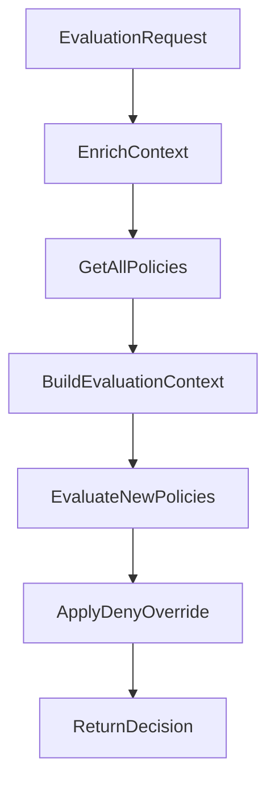

# Evaluator Package - Policy Decision Point (PDP)

## 📋 Tổng Quan

Package `evaluator` chứa **Policy Decision Point (PDP)** - core engine của hệ thống ABAC (Attribute-Based Access Control). Đây là component chính thực hiện policy evaluation và đưa ra quyết định access control dựa trên attributes của subject, resource, action và environment context.

## 🎯 Trách Nhiệm Chính

1. **Policy Evaluation**: Đánh giá access requests dựa trên defined policies
2. **Decision Making**: Đưa ra quyết định PERMIT/DENY/NOT_APPLICABLE
3. **Rule Processing**: Xử lý complex rule logic với multiple conditions
4. **Pattern Matching**: Hỗ trợ wildcard và variable substitution cho actions/resources
5. **Condition Evaluation**: Đánh giá điều kiện phức tạp với nhiều operators
6. **Performance Optimization**: Fast evaluation với short-circuit logic và deny-override

## 📁 Cấu Trúc Files

```
evaluator/
├── pdp.go                  # Policy Decision Point - Main evaluation engine
├── conditions.go           # Condition evaluation với nhiều operators
├── matching.go            # Action và Resource pattern matching
├── new_policy_test.go     # Comprehensive unit tests
└── README.md              # Documentation (file này)
```

## 🏗️ Core Architecture

### 1. PolicyDecisionPointInterface - Main Contract

```go
type PolicyDecisionPointInterface interface {
    // Optimized evaluation method combining best practices
    Evaluate(request *models.EvaluationRequest) (*models.Decision, error)
}
```

**Benefits của Interface:**
- **Testability**: Dễ dàng tạo mock implementations cho testing
- **Flexibility**: Có thể swap implementations mà không thay đổi client code
- **Dependency Injection**: Clean dependency management
- **Abstraction**: Hide implementation details từ consumers

### 2. PolicyDecisionPoint (PDP) - Concrete Implementation

```go
type PolicyDecisionPoint struct {
    storage            storage.Storage              // Data access layer
    attributeResolver  *attributes.AttributeResolver // Attribute resolution
    operatorRegistry   *operators.OperatorRegistry  // Rule operators (legacy)
    actionMatcher      *ActionMatcher              // Action pattern matching
    resourceMatcher    *ResourceMatcher            // Resource pattern matching  
    conditionEvaluator *ConditionEvaluator         // Condition evaluation
}
```

**Key Dependencies:**
- **Storage**: Access policies, subjects, resources, actions
- **AttributeResolver**: Enrich context với full attributes
- **ActionMatcher**: Match action patterns với wildcards
- **ResourceMatcher**: Match resource patterns với variable substitution
- **ConditionEvaluator**: Evaluate complex conditions

### 3. ActionMatcher - Action Pattern Matching

```go
type ActionMatcher struct{}
```

**Supported Patterns:**
- **Exact match**: `document-service:file:read`
- **Wildcard segments**: `document-service:file:*`, `*:*:read`
- **Full wildcard**: `*` (matches anything)

**Pattern Format**: `<service>:<resource-type>:<operation>`

### 4. ResourceMatcher - Resource Pattern Matching

```go
type ResourceMatcher struct{}
```

**Supported Patterns:**
- **Exact match**: `api:documents:doc-123`
- **Wildcard segments**: `api:documents:*`, `api:*:doc-123`
- **Variable substitution**: `api:documents:owner:${request:UserId}/*`
- **Hierarchical resources**: `api:documents:folder-1/file-2`

### 5. ConditionEvaluator - Complex Condition Logic

```go
type ConditionEvaluator struct{}
```

**Supported Operators:**
- **String**: `StringEquals`, `StringNotEquals`, `StringLike`
- **Numeric**: `NumericLessThan`, `NumericGreaterThan`, etc.
- **Boolean**: `Bool`
- **Network**: `IpAddress` (CIDR support)
- **Date/Time**: `DateGreaterThan`, `DateLessThan`

## 🔄 Evaluation Flow Chi Tiết

### Main Evaluation Process



### Step-by-Step Process

#### Step 1: Context Enrichment
```go
context, err := pdp.attributeResolver.EnrichContext(request)
```

**Input**: Basic EvaluationRequest
```json
{
  "subject_id": "user-123",
  "resource_id": "api:documents:doc-456", 
  "action": "document-service:file:read",
  "context": {
    "source_ip": "192.168.1.100",
    "timestamp": "2024-01-15T14:00:00Z"
  }
}
```

**Output**: Rich EvaluationContext với full attributes

#### Step 2: Build Evaluation Context
```go
evalContext := pdp.buildEvaluationContext(request, context)
```

**Context Structure:**
```go
map[string]interface{}{
    // Request context
    "request:UserId":     "user-123",
    "request:Action":     "document-service:file:read", 
    "request:ResourceId": "api:documents:doc-456",
    "request:Time":       "2024-01-15T14:00:00Z",
    
    // User attributes
    "user:department":    "engineering",
    "user:role":         "senior_developer",
    "user:level":        5,
    
    // Resource attributes  
    "resource:owner":     "user-456",
    "resource:sensitivity": "confidential",
    
    // Environment
    "environment:source_ip": "192.168.1.100",
}
```

#### Step 3: Policy Evaluation với Deny-Override

```go
decision := pdp.evaluateNewPolicies(allPolicies, evalContext)
```

**Deny-Override Algorithm:**
1. **Evaluate all statements** trong tất cả enabled policies
2. **If any DENY statement matches** → Return DENY immediately (short-circuit)
3. **If any ALLOW statement matches** → Return PERMIT
4. **No matches** → Return DENY (implicit deny)

## 📝 Policy Format Support

### New JSON Policy Format (Recommended)

```json
{
  "Version": "2024-01-01",
  "Id": "engineering-document-access",
  "Statement": [
    {
      "Sid": "AllowEngineeringRead",
      "Effect": "Allow",
      "Action": {
        "StringEquals": ["document-service:file:read"]
      },
      "Resource": {
        "StringLike": ["api:documents:*"]
      },
      "Condition": {
        "StringEquals": {
          "user:department": "engineering"
        },
        "NumericGreaterThanEquals": {
          "user:level": 3
        }
      }
    }
  ]
}
```

### Legacy Policy Format (Still Supported)

```json
{
  "id": "pol-001",
  "policy_name": "Engineering Read Access",
  "effect": "permit",
  "priority": 100,
  "actions": ["read"],
  "resource_patterns": ["/api/v1/*"],
  "rules": [
    {
      "target_type": "subject",
      "attribute_path": "attributes.department",
      "operator": "eq",
      "expected_value": "engineering"
    }
  ]
}
```

## 🔍 Pattern Matching Examples

### Action Patterns

```go
// Exact match
"document-service:file:read" matches "document-service:file:read" ✅
"document-service:file:read" matches "document-service:file:write" ❌

// Wildcard patterns  
"document-service:file:*" matches "document-service:file:read" ✅
"document-service:*:read" matches "document-service:folder:read" ✅
"*:*:read" matches "payment-service:transaction:read" ✅
"*" matches "any:action:here" ✅
```

### Resource Patterns

```go
// Basic patterns
"api:documents:*" matches "api:documents:doc-123" ✅
"api:*:doc-123" matches "api:documents:doc-123" ✅

// Variable substitution
"api:documents:owner:${request:UserId}/*" 
  → "api:documents:owner:user-123/*"
  → matches "api:documents:owner:user-123/file-1" ✅

// Hierarchical resources
"api:documents:folder-1/*" matches "api:documents:folder-1/file-2" ✅
```

## 🧮 Condition Evaluation Examples

### String Conditions

```json
{
  "StringEquals": {
    "user:department": "engineering"
  },
  "StringLike": {
    "resource:path": "/documents/eng-*"
  }
}
```

### Numeric Conditions

```json
{
  "NumericGreaterThanEquals": {
    "user:level": 3
  },
  "NumericLessThan": {
    "resource:size": 1000000
  }
}
```

### IP Address Conditions

```json
{
  "IpAddress": {
    "request:source_ip": ["192.168.1.0/24", "10.0.0.0/8"]
  }
}
```

### Date/Time Conditions

```json
{
  "DateGreaterThan": {
    "request:time": "2024-01-01T00:00:00Z"
  }
}
```

### Variable Substitution

```json
{
  "StringEquals": {
    "resource:owner": "${request:UserId}"
  }
}
```

## 🚀 Evaluation Examples

### Example 1: Engineering Document Access

**Request:**
```json
{
  "subject_id": "user-123",
  "resource_id": "api:documents:doc-456",
  "action": "document-service:file:read"
}
```

**Policy Statement:**
```json
{
  "Effect": "Allow",
  "Action": {"StringEquals": ["document-service:file:read"]},
  "Resource": {"StringLike": ["api:documents:*"]},
  "Condition": {
    "StringEquals": {"user:department": "engineering"},
    "NumericGreaterThanEquals": {"user:level": 3}
  }
}
```

**Evaluation Steps:**
1. **Action Match**: `document-service:file:read` == `document-service:file:read` ✅
2. **Resource Match**: `api:documents:doc-456` matches `api:documents:*` ✅  
3. **Condition Check**:
   - `user:department` == `"engineering"` ✅
   - `user:level` >= `3` (5 >= 3) ✅

**Result**: PERMIT ✅

### Example 2: Deny Override Example

**Request:**
```json
{
  "subject_id": "user-probation",
  "resource_id": "api:documents:confidential-doc",
  "action": "document-service:file:write"
}
```

**Policy Statements:**
1. **Allow Statement** (matches):
   ```json
   {
     "Effect": "Allow",
     "Action": {"StringEquals": ["document-service:file:write"]},
     "Resource": {"StringLike": ["api:documents:*"]}
   }
   ```

2. **Deny Statement** (also matches):
   ```json
   {
     "Effect": "Deny", 
     "Action": {"StringEquals": ["document-service:file:write"]},
     "Condition": {
       "Bool": {"user:on_probation": true}
     }
   }
   ```

**Result**: DENY ❌ (Deny overrides Allow)

## ⚡ Performance Features

### 1. Deny-Override Short-Circuit
```go
if strings.ToLower(statement.Effect) == "deny" {
    return &models.Decision{
        Result: "deny",
        Reason: fmt.Sprintf("Denied by statement: %s", statement.Sid),
    }
}
```

### 2. Early Pattern Matching
- Action patterns checked first (fastest)
- Resource patterns checked second  
- Conditions evaluated last (most expensive)

### 3. Efficient Wildcard Matching
- Regex compilation cached
- Simple string operations for basic patterns
- Optimized for common patterns

### 4. Variable Substitution Caching
- Context values resolved once
- Variable substitution performed efficiently
- Nested object access optimized

## 🧪 Testing Strategy

### Unit Tests Coverage

```go
func TestActionMatcher(t *testing.T) {
    // Tests exact matches, wildcards, edge cases
}

func TestResourceMatcher(t *testing.T) {
    // Tests patterns, variables, hierarchical resources
}

func TestConditionEvaluator(t *testing.T) {
    // Tests all operators, type conversions, edge cases
}

func TestPolicyEvaluation(t *testing.T) {
    // Tests complete evaluation flow
}
```

### Test Categories

1. **Pattern Matching Tests**:
   - Exact matches
   - Wildcard patterns  
   - Variable substitution
   - Edge cases

2. **Condition Tests**:
   - All operator types
   - Type conversions
   - Null/empty values
   - Complex nested conditions

3. **Integration Tests**:
   - Complete evaluation flow
   - Multiple policies
   - Deny-override scenarios
   - Performance benchmarks

## 🔒 Security Features

### 1. Fail-Safe Defaults
```go
// Default to DENY on errors
if err != nil {
    return &models.Decision{
        Result: "deny",
        Reason: "Evaluation error - access denied for safety",
    }
}
```

### 2. Input Validation
```go
if request.SubjectID == "" || request.ResourceID == "" {
    return nil, fmt.Errorf("invalid request: missing required fields")
}
```

### 3. Deny-Override Policy
- DENY statements always override ALLOW statements
- Explicit deny beats implicit allow
- No policy match = implicit deny

### 4. Variable Injection Protection
- Safe variable substitution
- No code execution in patterns
- Bounded recursion depth

## 📊 API Methods

### Interface Usage

```go
// Create PDP instance using interface (recommended)
var pdp PolicyDecisionPointInterface = NewPolicyDecisionPoint(storage)

// Use the optimized evaluation method
decision, err := pdp.Evaluate(request)
if err != nil {
    log.Fatal(err)
}
```

### Constructor Methods

```go
// Returns interface (recommended for production)
func NewPolicyDecisionPoint(storage storage.Storage) PolicyDecisionPointInterface
```

### Main Evaluation Method

```go
// Optimized evaluation combining best practices from legacy approaches
func (pdp *PolicyDecisionPoint) Evaluate(request *models.EvaluationRequest) (*models.Decision, error)
```

### Testing với Interface

```go
// Mock implementation for testing
type MockPDP struct {
    decisions map[string]*models.Decision
}

func (m *MockPDP) Evaluate(req *models.EvaluationRequest) (*models.Decision, error) {
    key := fmt.Sprintf("%s:%s:%s", req.SubjectID, req.ResourceID, req.Action)
    if decision, exists := m.decisions[key]; exists {
        return decision, nil
    }
    return &models.Decision{Result: "deny"}, nil
}

// MockPDP now only needs to implement Evaluate method

// Usage in tests
func TestSomeFeature(t *testing.T) {
    mockPDP := &MockPDP{
        decisions: map[string]*models.Decision{
            "user-123:doc-456:read": {Result: "permit"},
        },
    }
    
    // Use mockPDP as PolicyDecisionPointInterface
    var pdp PolicyDecisionPointInterface = mockPDP
    decision, err := pdp.Evaluate(request)
    // ... test assertions
}
```

### Helper Methods

```go
// Build evaluation context
func (pdp *PolicyDecisionPoint) buildEvaluationContext(request, context) map[string]interface{}

// Evaluate single statement
func (pdp *PolicyDecisionPoint) evaluateStatement(statement, context) bool

// Pattern matching
func (am *ActionMatcher) Match(pattern, action string) bool
func (rm *ResourceMatcher) Match(pattern, resource string, context map[string]interface{}) bool

// Condition evaluation
func (ce *ConditionEvaluator) Evaluate(conditions, context map[string]interface{}) bool
```

## 🎯 Best Practices

### 1. Interface Usage
- **Use interface in production**: `NewPolicyDecisionPoint()` returns interface
- **Mock for unit tests**: Create mock implementations of interface
- **Dependency injection**: Pass interface to consumers, not concrete type

### 2. Policy Design
- **Keep statements focused**: One statement per specific use case
- **Use descriptive Sid**: Clear statement identifiers
- **Prefer ALLOW over DENY**: Use DENY sparingly for security policies
- **Order by specificity**: More specific conditions first

### 3. Pattern Design
- **Use wildcards judiciously**: Balance flexibility vs security
- **Leverage variable substitution**: Dynamic resource matching
- **Test pattern edge cases**: Ensure patterns work as expected

### 4. Condition Design
- **Combine operators logically**: All conditions in a block are AND-ed
- **Use appropriate operators**: Choose the right operator for data type
- **Handle null values**: Consider missing attributes in conditions

### 5. Performance Optimization
- **Minimize condition complexity**: Simple conditions evaluate faster
- **Use efficient patterns**: Avoid overly complex regex patterns
- **Cache context values**: Reuse resolved attributes

### 6. Security Guidelines
- **Default to deny**: No matching policy = access denied
- **Use deny-override**: Critical security policies should deny
- **Validate inputs**: Always validate request parameters
- **Audit decisions**: Log all access decisions for security monitoring

## 📈 Monitoring & Metrics

### Key Performance Indicators
- **Evaluation Latency**: P50, P95, P99 response times
- **Decision Distribution**: PERMIT vs DENY ratios
- **Policy Coverage**: Percentage of requests matching policies
- **Error Rate**: Failed evaluations per total requests

### Performance Targets
- **Latency**: < 5ms per evaluation
- **Throughput**: > 2000 evaluations/second
- **Memory Usage**: < 100MB for policy cache
- **CPU Usage**: < 50% under normal load

Package `evaluator` cung cấp một powerful, flexible, và secure policy evaluation engine cho ABAC system, hỗ trợ cả legacy và modern policy formats với comprehensive pattern matching và condition evaluation capabilities.