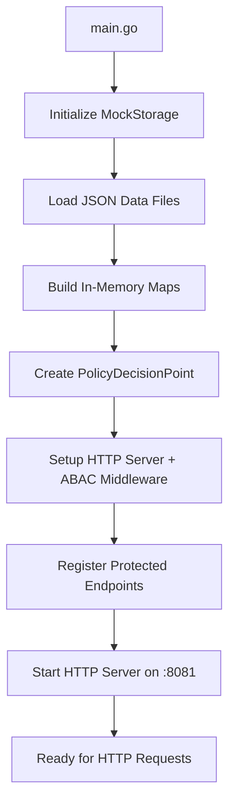
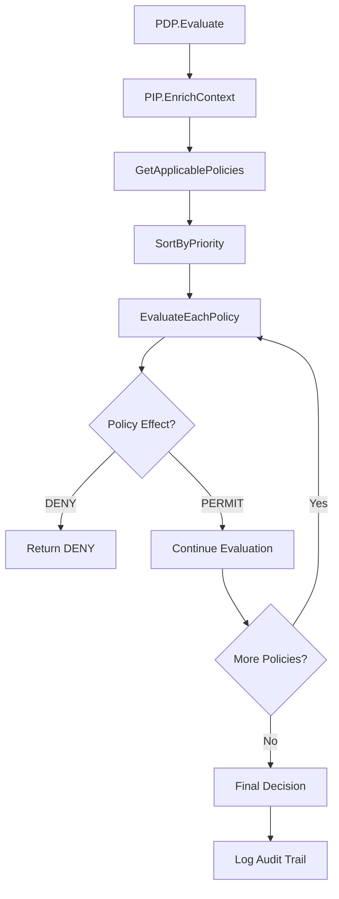

# Tài Liệu Chi Tiết Hệ Thống ABAC (Attribute-Based Access Control)

## 📋 Tổng Quan Hệ Thống

Hệ thống ABAC này được triển khai dưới dạng **HTTP Service đơn giản** để quản lý quyền truy cập dựa trên thuộc tính (Attribute-Based Access Control). Hệ thống tập trung vào **luồng ABAC cơ bản** với kiến trúc đơn giản, dễ hiểu và dễ tích hợp.

### 🎯 Mục Tiêu Thiết Kế
- **Đơn giản hóa** - Loại bỏ các tính năng phức tạp không cần thiết
- **HTTP-first** - RESTful API service thay vì CLI tool
- **Dễ tích hợp** - Middleware pattern cho existing applications  
- **Luồng rõ ràng** - User → PEP → PDP → PIP → PAP → Decision → Enforce

## 🏗️ Kiến Trúc Tổng Thể

### 1. Cấu Trúc Package

```
abac_go_example/
├── main.go                 # Entry point và demo scenarios
├── cmd/                    # Command-line tools
│   └── migrate/           # Database migration và seeding
│       └── main.go        # Migration script
├── models/                 # Data models và types
│   ├── types.go           # Core data structures với GORM tags
│   └── types_test.go      # Unit tests cho models
├── evaluator/             # PDP - Policy Decision Point
│   ├── pdp.go            # Core evaluation engine
│   └── pdp_test.go       # Unit tests cho evaluator
├── attributes/            # PIP - Policy Information Point
│   ├── resolver.go       # Attribute resolution logic (updated for GORM types)
│   └── resolver_test.go  # Unit tests cho attributes
├── operators/             # Rule operators
│   ├── operators.go      # Comparison operators
│   └── operators_test.go # Unit tests cho operators
├── storage/               # Data access layer
│   ├── mock_storage.go   # JSON-based mock storage (legacy)
│   ├── postgresql_storage.go # PostgreSQL implementation với GORM
│   ├── database.go       # Database connection management
│   └── mock_storage_test.go
├── audit/                 # Audit logging
│   ├── logger.go         # Audit trail management
│   └── logger_test.go
├── pep/                   # PEP - Policy Enforcement Point
│   ├── core.go           # Full-featured PEP (advanced features)
│   ├── simple_pep.go     # Simplified PEP for basic usage
│   ├── middleware.go     # HTTP middleware integration
│   ├── interceptor.go    # Method-level interceptors
│   ├── examples.go       # Integration examples
│   ├── cache.go          # Decision caching (future)
│   ├── rate_limiter.go   # Rate limiting (future)
│   ├── circuit_breaker.go # Circuit breaker (future)
│   ├── metrics.go        # Performance metrics (future)
│   ├── README.md         # PEP documentation
│   └── *_test.go         # Comprehensive tests
├── docker-compose.yml     # PostgreSQL development environment
├── init.sql              # Database initialization script
├── DATABASE_SETUP.md     # Database setup documentation
└── *.json                # Mock data files (cho development)
```

### 2. Các Component Chính

#### A. **Policy Decision Point (PDP)** - `evaluator/pdp.go`
- **Chức năng**: Engine chính để đánh giá quyền truy cập
- **Input**: EvaluationRequest (Subject, Resource, Action, Context)
- **Output**: Decision (Permit/Deny/NotApplicable)

#### B. **Policy Information Point (PIP)** - `attributes/resolver.go`
- **Chức năng**: Resolve và enrich attributes từ các nguồn khác nhau
- **Tính năng**: Dynamic attributes, hierarchical resources, environment context

#### C. **Storage Layer** - `storage/`
- **Chức năng**: Data access abstraction với multiple implementations
- **PostgreSQL Storage**: Production-ready với GORM ORM (`postgresql_storage.go`)
- **Mock Storage**: JSON-based mock storage cho development (`mock_storage.go`)
- **Database Management**: Connection pooling và configuration (`database.go`)

#### D. **Policy Enforcement Point (PEP)** - `pep/`
- **Chức năng**: Enforcement engine tích hợp với applications
- **Features**: HTTP middleware, method interceptors, service integration
- **Components**: SimplePEP (basic), FullPEP (advanced features)

#### E. **Audit System** - `audit/logger.go`
- **Chức năng**: Logging và compliance tracking
- **Features**: Structured logging, security events, compliance reports

## 🔄 Flow Hoạt Động Chi Tiết

### 1. HTTP Service Initialization Flow



**Chi tiết từng bước:**

1. **MockStorage Initialization**:
   ```go
   storage, err := storage.NewMockStorage(".")
   ```
   - Load `subjects.json`, `resources.json`, `actions.json`, `policies.json`
   - Build in-memory maps cho fast lookup (O(1) access)
   - Validate data integrity và relationships
   - Support resource lookup by both ID và ResourceID

2. **PDP Creation**:
   ```go
   pdp := evaluator.NewPolicyDecisionPoint(storage)
   ```
   - Initialize AttributeResolver với storage reference
   - Initialize OperatorRegistry với default operators
   - Setup evaluation engine cho policy processing

3. **HTTP Server Setup**:
   ```go
   server := &http.Server{
       Addr:    ":8081",
       Handler: corsHandler(mux),
   }
   ```
   - Setup CORS middleware cho cross-origin requests
   - Register protected endpoints với ABAC middleware
   - Configure graceful shutdown handling

### 2. HTTP Request Evaluation Flow

```mermaid
graph TD
    A[HTTP Request + X-Subject-ID] --> B[ABAC Middleware]
    B --> C[Extract Subject/Resource/Action]
    C --> D[Create EvaluationRequest]
    D --> E[PDP.Evaluate]
    E --> F[PIP.EnrichContext]
    F --> G[PAP.GetPolicies]
    G --> H[Policy Evaluation]
    H --> I{Decision?}
    I -->|PERMIT| J[Forward to Handler]
    I -->|DENY| K[Return 403 Forbidden]
    J --> L[Business Logic Response]
    K --> M[Error Response với Reason]
```



**Chi tiết luồng HTTP Request:**

1. **HTTP Request** - Client gửi request với header `X-Subject-ID`
2. **ABAC Middleware** - Intercept request trước khi đến handler
3. **Extract Information**:
   - Subject = `X-Subject-ID` header value
   - Resource = URL path (e.g., `/api/v1/users`)
   - Action = required permission (e.g., `read`, `write`, `admin`)
4. **Create EvaluationRequest** - Package thông tin thành request object
5. **PDP Evaluation** - Gọi Policy Decision Point
6. **Decision Enforcement**:
   - **PERMIT** → Forward request đến business logic handler
   - **DENY/NOT_APPLICABLE** → Return 403 Forbidden với reason

### 3. Detailed PDP Evaluation Flow



**Chi tiết từng bước:**

#### Bước 1: Context Enrichment
```go
func (r *AttributeResolver) EnrichContext(request *models.EvaluationRequest) (*models.EvaluationContext, error)
```

**Input Processing:**
- Subject ID → Subject object với full attributes
- Resource ID → Resource object với metadata
- Action name → Action object với category info
- Environment context → Enriched với derived attributes

**Environment Enrichment:**
```go
// Từ timestamp → derive time_of_day, day_of_week, is_business_hours
if timestampStr, ok := enriched["timestamp"].(string); ok {
    if t, err := time.Parse(time.RFC3339, timestampStr); err == nil {
        enriched["time_of_day"] = t.Format("15:04")
        enriched["day_of_week"] = strings.ToLower(t.Weekday().String())
        enriched["hour"] = t.Hour()
        enriched["is_business_hours"] = r.isBusinessHours(t)
    }
}

// Từ source_ip → derive is_internal_ip, ip_subnet
if sourceIP, ok := enriched["source_ip"].(string); ok {
    enriched["is_internal_ip"] = r.isInternalIP(sourceIP)
    enriched["ip_subnet"] = r.getIPSubnet(sourceIP)
}
```

**Dynamic Subject Attributes:**
```go
// Calculate years_of_service từ hire_date
if hireDateStr, ok := subject.Attributes["hire_date"].(string); ok {
    if hireDate, err := time.Parse("2006-01-02", hireDateStr); err == nil {
        years := time.Since(hireDate).Hours() / (24 * 365.25)
        subject.Attributes["years_of_service"] = int(years)
    }
}
```

#### Bước 2: Policy Filtering
```go
func (pdp *PolicyDecisionPoint) filterApplicablePolicies(policies []*models.Policy, context *models.EvaluationContext) []*models.Policy
```

**Filter Criteria:**
1. **Enabled Check**: `policy.Enabled == true`
2. **Action Match**: 
   ```go
   func (pdp *PolicyDecisionPoint) actionMatches(policyActions []string, requestedAction string) bool {
       for _, action := range policyActions {
           if action == "*" || action == requestedAction {
               return true
           }
       }
       return false
   }
   ```
3. **Resource Pattern Match**:
   ```go
   func (pdp *PolicyDecisionPoint) resourcePatternMatches(patterns []string, resource *models.Resource) bool {
       for _, pattern := range patterns {
           if pdp.attributeResolver.MatchResourcePattern(pattern, resourcePath) {
               return true
           }
       }
       return false
   }
   ```

**Wildcard Pattern Matching:**
- `*` matches anything
- `/api/v1/*` matches `/api/v1/users`, `/api/v1/orders`
- `DOC-*-FINANCE` matches `DOC-2024-Q1-FINANCE`

#### Bước 3: Policy Evaluation với Priority
```go
// Sort policies by priority (ascending - lower number = higher priority)
sort.Slice(applicablePolicies, func(i, j int) bool {
    return applicablePolicies[i].Priority < applicablePolicies[j].Priority
})
```

**Priority Logic:**
- Priority 10 (cao nhất) → Priority 100 (thấp nhất)
- DENY policies thường có priority cao (10-30)
- PERMIT policies có priority thấp hơn (50-100)

#### Bước 4: Rule Evaluation
```go
func (pdp *PolicyDecisionPoint) evaluateRule(rule models.PolicyRule, context *models.EvaluationContext) bool
```

**Rule Structure:**
```json
{
  "target_type": "subject|resource|action|environment",
  "attribute_path": "attributes.department",
  "operator": "eq|in|contains|regex|gt|gte|lt|lte|between",
  "expected_value": "engineering",
  "is_negative": false
}
```

**Attribute Path Resolution:**
- Dot notation: `attributes.department`
- Nested access: `metadata.full_name`
- Array access: `attributes.role` (array)

**Operator Evaluation:**
```go
// Get actual value
switch rule.TargetType {
case "subject":
    actualValue = pdp.attributeResolver.GetAttributeValue(context.Subject, rule.AttributePath)
case "resource":
    actualValue = pdp.attributeResolver.GetAttributeValue(context.Resource, rule.AttributePath)
case "environment":
    actualValue = pdp.attributeResolver.GetAttributeValue(context.Environment, rule.AttributePath)
}

// Apply operator
operator, _ := pdp.operatorRegistry.Get(rule.Operator)
result := operator.Evaluate(actualValue, rule.ExpectedValue)

// Apply negation if needed
if rule.IsNegative {
    result = !result
}
```

#### Bước 5: Decision Logic
```go
func (pdp *PolicyDecisionPoint) evaluatePolicies(policies []*models.Policy, context *models.EvaluationContext) *models.Decision
```

**Short-Circuit Logic:**
1. **DENY Override**: Ngay khi gặp policy DENY match → return DENY
2. **PERMIT Accumulation**: Collect tất cả PERMIT policies
3. **Final Decision**:
   - Có DENY → DENY
   - Không có DENY + Có PERMIT → PERMIT  
   - Không có gì → NOT_APPLICABLE

## 📊 Data Models Chi Tiết

### 1. Database Schema với GORM

Hệ thống hỗ trợ PostgreSQL với GORM ORM cho production environment. Tất cả models được định nghĩa với GORM tags để auto-migration và type handling.

#### Custom JSONB Types
```go
// JSONMap - Custom type cho map[string]interface{} → PostgreSQL JSONB
type JSONMap map[string]interface{}

// JSONStringSlice - Custom type cho []string → PostgreSQL JSONB  
type JSONStringSlice []string

// JSONPolicyRules - Custom type cho []PolicyRule → PostgreSQL JSONB
type JSONPolicyRules []PolicyRule
```

**GORM Value/Scan Implementation:**
- Implement `driver.Valuer` interface cho write operations
- Implement `sql.Scanner` interface cho read operations
- Automatic JSON marshaling/unmarshaling
- PostgreSQL JSONB indexing support

### 2. Subject Model với GORM Tags
```go
type Subject struct {
    ID          string    `json:"id" gorm:"primaryKey;size:255"`
    ExternalID  string    `json:"external_id" gorm:"size:255;index"`
    SubjectType string    `json:"subject_type" gorm:"size:100;not null;index"`
    Metadata    JSONMap   `json:"metadata" gorm:"type:jsonb"`
    Attributes  JSONMap   `json:"attributes" gorm:"type:jsonb"`
    CreatedAt   time.Time `json:"created_at,omitempty" gorm:"autoCreateTime"`
    UpdatedAt   time.Time `json:"updated_at,omitempty" gorm:"autoUpdateTime"`
}
```

**GORM Features:**
- **Primary Key**: `ID` field với custom size limit
- **Indexes**: Auto-generated indexes trên `external_id` và `subject_type`
- **JSONB Storage**: `Metadata` và `Attributes` stored as PostgreSQL JSONB
- **Timestamps**: Auto-managed `created_at` và `updated_at`

**Subject Examples:**
```json
{
  "id": "sub-001",
  "external_id": "john.doe@company.com",
  "subject_type": "user",
  "attributes": {
    "department": "engineering",
    "role": ["senior_developer", "code_reviewer"],
    "clearance_level": 3,
    "years_of_service": 5,
    "on_probation": false
  }
}
```

### 3. Resource Model với GORM Tags
```go
type Resource struct {
    ID           string    `json:"id" gorm:"primaryKey;size:255"`
    ResourceType string    `json:"resource_type" gorm:"size:100;not null;index"`
    ResourceID   string    `json:"resource_id" gorm:"size:500;index"`
    Path         string    `json:"path" gorm:"size:1000"`
    ParentID     string    `json:"parent_id" gorm:"size:255;index"`
    Metadata     JSONMap   `json:"metadata" gorm:"type:jsonb"`
    Attributes   JSONMap   `json:"attributes" gorm:"type:jsonb"`
    CreatedAt    time.Time `json:"created_at,omitempty" gorm:"autoCreateTime"`
}
```

### 4. Policy Model với GORM Tags  
```go
type Policy struct {
    ID               string          `json:"id" gorm:"primaryKey;size:255"`
    PolicyName       string          `json:"policy_name" gorm:"size:255;not null;index"`
    Description      string          `json:"description" gorm:"type:text"`
    Effect           string          `json:"effect" gorm:"size:20;not null;index"`
    Priority         int             `json:"priority" gorm:"not null;index"`
    Enabled          bool            `json:"enabled" gorm:"not null;default:true;index"`
    Version          int             `json:"version" gorm:"not null;default:1"`
    Conditions       JSONMap         `json:"conditions" gorm:"type:jsonb"`
    Rules            JSONPolicyRules `json:"rules" gorm:"type:jsonb"`
    Actions          JSONStringSlice `json:"actions" gorm:"type:jsonb"`
    ResourcePatterns JSONStringSlice `json:"resource_patterns" gorm:"type:jsonb"`
    CreatedAt        time.Time       `json:"created_at,omitempty" gorm:"autoCreateTime"`
    UpdatedAt        time.Time       `json:"updated_at,omitempty" gorm:"autoUpdateTime"`
}
```

### 5. Database Migration & Seeding

**Auto-Migration:**
```go
// Auto-migrate all models
err = db.AutoMigrate(
    &models.Subject{},
    &models.Resource{}, 
    &models.Action{},
    &models.Policy{},
    &models.AuditLog{},
)
```

**Data Seeding từ JSON:**
```bash
# Run migration và seed data
go run cmd/migrate/main.go
```

**Migration Features:**
- Automatic schema creation/updates
- Index creation cho performance
- JSONB column setup
- Foreign key constraints
**Resource Types:**
- `api_endpoint`: REST APIs
- `database`: Database resources  
- `document`: Files/documents
- `kubernetes_namespace`: K8s resources
### 6. Policy Examples với Database Storage

**PERMIT Policy:**
```json
{
  "id": "pol-001",
  "policy_name": "Engineering Read Access",
  "effect": "permit",
  "priority": 100,
  "rules": [
    {
      "target_type": "subject",
      "attribute_path": "attributes.department",
      "operator": "eq",
      "expected_value": "engineering"
    }
  ],
  "actions": ["read"],
  "resource_patterns": ["/api/v1/*"]
}
```

**DENY Policy:**
```json
{
  "id": "pol-004",
  "policy_name": "Deny Probation Write",
  "effect": "deny",
  "priority": 10,
  "rules": [
    {
      "target_type": "subject",
      "attribute_path": "attributes.on_probation",
      "operator": "eq",
      "expected_value": true
    }
  ],
  "actions": ["write", "delete", "deploy"],
  "resource_patterns": ["*"]
}
```

## 🔧 Operators Chi Tiết

### 1. Comparison Operators
```go
// Basic comparison
"eq"    // Equal: actual == expected
"neq"   // Not equal: actual != expected
"gt"    // Greater than: actual > expected
"gte"   // Greater than or equal: actual >= expected
"lt"    // Less than: actual < expected
"lte"   // Less than or equal: actual <= expected
```

### 2. Collection Operators
```go
"in"       // Value in array: actual ∈ expected[]
"nin"      // Value not in array: actual ∉ expected[]
"contains" // Array contains value: expected ∈ actual[]
```

**Examples:**
```json
// Subject role contains "senior_developer"
{
  "target_type": "subject",
  "attribute_path": "attributes.role",
  "operator": "contains",
  "expected_value": "senior_developer"
}

// Data classification in allowed list
{
  "target_type": "resource", 
  "attribute_path": "attributes.data_classification",
  "operator": "in",
  "expected_value": ["public", "internal"]
}
```

### 3. Pattern Operators
```go
"regex"   // Regular expression matching
"between" // Range check (numbers or time)
"exists"  // Value exists (not nil)
```

**Time Range Example:**
```json
{
  "target_type": "environment",
  "attribute_path": "time_of_day", 
  "operator": "between",
  "expected_value": ["08:00", "20:00"]
}
```

**Regex Example:**
```json
{
  "target_type": "environment",
  "attribute_path": "source_ip",
  "operator": "regex", 
  "expected_value": "^10\\."
}
```

## 🔍 Evaluation Scenarios

### Scenario 1: Engineering Read Access
**Request:**
```json
{
  "subject_id": "sub-001",    // John Doe (Senior Developer)
  "resource_id": "res-001",   // /api/v1/users
  "action": "read",
  "context": {
    "timestamp": "2024-01-15T14:00:00Z",
    "source_ip": "10.0.1.50"
  }
}
```

**Evaluation Process:**
1. **Context Enrichment:**
   - Subject: John Doe, department=engineering, role=[senior_developer]
   - Resource: /api/v1/users, data_classification=internal
   - Environment: time_of_day=14:00, is_business_hours=true

2. **Applicable Policies:**
   - pol-001: Engineering Read Access (priority 100)
   - pol-002: Senior Developer Write Access (priority 50)

3. **Policy Evaluation:**
   - **pol-002** (priority 50): 
     - ✅ subject.role contains "senior_developer"
     - ✅ subject.years_of_service >= 2 (5 >= 2)
     - ✅ environment.time_of_day between ["08:00", "20:00"]
     - **Effect: PERMIT**
   
   - **pol-001** (priority 100):
     - ✅ subject.department == "engineering"
     - ✅ resource.data_classification in ["public", "internal"]
     - **Effect: PERMIT**

4. **Final Decision:** **PERMIT** (có permit policies, không có deny)

### Scenario 2: Probation Write Denial
**Request:**
```json
{
  "subject_id": "sub-004",    // Bob Wilson (On Probation)
  "resource_id": "res-002",   // Production Database
  "action": "write"
}
```

**Evaluation Process:**
1. **Context Enrichment:**
   - Subject: Bob Wilson, on_probation=true, department=engineering
   - Resource: prod-db-customers, data_classification=confidential

2. **Applicable Policies:**
   - pol-004: Deny Probation Write (priority 10) 
   - pol-001: Engineering Read Access (priority 100)

3. **Policy Evaluation:**
   - **pol-004** (priority 10):
     - ✅ subject.on_probation == true
     - ✅ action in ["write", "delete", "deploy"]
     - **Effect: DENY** → **Short Circuit!**

4. **Final Decision:** **DENY** (deny policy matched)

### Scenario 3: Finance Confidential Access
**Request:**
```json
{
  "subject_id": "sub-002",    // Alice Smith (Finance)
  "resource_id": "res-003",   // Financial Report
  "action": "read"
}
```

**Evaluation Process:**
1. **Context Enrichment:**
   - Subject: Alice Smith, department=finance, clearance_level=2
   - Resource: DOC-2024-Q1-FINANCE, document_type=financial_report

2. **Applicable Policies:**
   - pol-003: Finance Confidential Access (priority 30)

3. **Policy Evaluation:**
   - **pol-003** (priority 30):
     - ✅ subject.department == "finance"
     - ✅ subject.clearance_level >= 2 (2 >= 2)
     - ✅ resource.document_type == "financial_report"
     - **Effect: PERMIT**

4. **Final Decision:** **PERMIT**

## 📝 Audit & Logging

### 1. Audit Log Structure
```go
type AuditLog struct {
    ID           int64                  `json:"id"`
    RequestID    string                 `json:"request_id"`
    SubjectID    string                 `json:"subject_id"`
    ResourceID   string                 `json:"resource_id"`
    ActionID     string                 `json:"action_id"`
    Decision     string                 `json:"decision"`
    EvaluationMs int                    `json:"evaluation_ms"`
    Context      map[string]interface{} `json:"context"`
    CreatedAt    time.Time              `json:"created_at"`
}
```

### 2. Audit Events
- **Policy Evaluations**: Mọi access request
- **Security Events**: Failed access, suspicious activity
- **Policy Changes**: Configuration modifications
- **Compliance Reports**: Periodic summaries

### 3. Security Event Examples
```go
// Probation user attempting write
auditLogger.LogSecurityEvent("probation_write_attempt", "sub-004", map[string]interface{}{
    "resource": "res-002",
    "action":   "write", 
    "blocked":  true,
})

// External IP access
auditLogger.LogSecurityEvent("external_ip_access", "sub-003", map[string]interface{}{
    "source_ip": "203.0.113.1",
    "blocked":   true,
})
```

## ⚡ Performance Optimizations

### 1. Storage & Policy Filtering
- **Value-Based Storage**: Use values instead of pointers cho better memory efficiency
- **Early Filtering**: Filter by action và resource pattern trước khi evaluate rules
- **Priority Sorting**: Sort một lần, evaluate theo thứ tự
- **Short Circuit**: Dừng ngay khi gặp DENY

### 2. Attribute Resolution
- **Caching**: Cache resolved attributes trong request lifecycle
- **Lazy Loading**: Chỉ load attributes khi cần
- **Batch Operations**: Group similar requests

### 3. Memory Management
- **Value-Based Maps**: Store entities as values to reduce heap allocations
- **Object Pooling**: Reuse Decision objects
- **String Interning**: Cache common strings
- **Minimal Allocations**: Avoid unnecessary object creation
- **Better Cache Locality**: Contiguous memory layout cho improved CPU cache performance

## 🧪 Testing Strategy

### 1. Unit Tests
- **Operators**: Test từng operator riêng biệt
- **Attribute Resolution**: Test path resolution logic
- **Policy Evaluation**: Test rule matching logic

### 2. Integration Tests
- **Full Flow**: End-to-end evaluation scenarios
- **Mock Data**: Test với realistic data
- **Edge Cases**: Boundary conditions, error handling

### 3. Performance Tests
```go
func BenchmarkPolicyEvaluation(b *testing.B) {
    // Test evaluation performance với large policy sets
    // Target: < 10ms per evaluation
}
```

## 🔒 Security Considerations

### 1. Fail-Safe Defaults
- **Default DENY**: Khi không có policy match
- **Error Handling**: Lỗi → DENY
- **Validation**: Strict input validation

### 2. Audit Trail
- **Complete Logging**: Log mọi decision
- **Tamper-Proof**: Immutable audit logs
- **Compliance**: Support regulatory requirements

### 3. Attack Vectors
- **Policy Injection**: Validate policy syntax
- **Attribute Manipulation**: Sanitize inputs
- **DoS Protection**: Rate limiting, timeouts

## 📈 Monitoring & Metrics

### 1. Performance Metrics
- **Evaluation Latency**: Average/P95/P99 response times (~3-8ms)
- **Storage Access**: ~50ns per entity lookup với value-based optimization
- **Throughput**: Requests per second (1000+)
- **Policy Coverage**: Percentage of requests matching policies
- **Memory Efficiency**: Reduced heap allocations với value storage

### 2. Security Metrics
- **Deny Rate**: Percentage of denied requests
- **Policy Violations**: Security rule breaches
- **Unusual Activity**: Anomaly detection

### 3. Operational Metrics
- **System Health**: Component availability
- **Error Rates**: Failed evaluations
- **Resource Usage**: Memory/CPU consumption

## 🚀 Deployment & Scaling

### 1. Horizontal Scaling
- **Stateless Design**: No shared state between instances
- **Load Balancing**: Distribute requests evenly
- **Auto Scaling**: Scale based on load

### 2. High Availability
- **Multi-Region**: Deploy across regions
- **Failover**: Automatic failover mechanisms
- **Circuit Breakers**: Prevent cascade failures

### 3. Configuration Management
- **Hot Reload**: Update policies without restart
- **Version Control**: Track policy changes
- **Rollback**: Quick rollback capabilities

## 🔧 Policy Enforcement Point (PEP) Integration

### 1. PEP Architecture

PEP là điểm tích hợp chính giữa applications và ABAC system. Hệ thống cung cấp multiple integration patterns:

#### A. **SimplePolicyEnforcementPoint** - Basic Implementation
```go
// Basic PEP without advanced features
pep := pep.NewSimplePolicyEnforcementPoint(pdp, auditLogger, config)

result, err := pep.EnforceRequest(ctx, &models.EvaluationRequest{
    SubjectID:  "user-123",
    ResourceID: "/api/users",
    Action:     "read",
})

if result.Allowed {
    // Proceed with operation
}
```

#### B. **HTTP Middleware Integration**
```go
// Web application integration
middleware := pep.NewHTTPMiddleware(pepInstance, nil)
mux.Handle("/api/users", middleware.Handler(http.HandlerFunc(handleUsers)))

// RESTful API integration
restMiddleware := pep.NewRESTfulMiddleware(pepInstance)
router.Use(restMiddleware.Handler)
```

#### C. **Service-Level Integration**
```go
type SecureService struct {
    pep *pep.SimplePolicyEnforcementPoint
}

func (s *SecureService) GetUser(ctx context.Context, subjectID, userID string) error {
    request := &models.EvaluationRequest{
        SubjectID:  subjectID,
        ResourceID: fmt.Sprintf("user:%s", userID),
        Action:     "read",
    }
    
    result, err := s.pep.EnforceRequest(ctx, request)
    if err != nil || !result.Allowed {
        return fmt.Errorf("access denied: %s", result.Reason)
    }
    
    // Business logic here
    return nil
}
```

### 2. Integration Patterns

#### HTTP Middleware Pattern
- **Use Case**: Web applications, REST APIs
- **Features**: Automatic subject extraction, resource mapping, context enrichment
- **Configuration**: Skip paths, custom extractors, error handling

#### Method Interceptor Pattern
- **Use Case**: Function-level access control
- **Features**: Service method protection, database operation control
- **Configuration**: Default subjects, resource mapping, timeout handling

#### Service Integration Pattern
- **Use Case**: Business service protection
- **Features**: Custom evaluation requests, rich context
- **Configuration**: Service-specific policies, operation mapping

### 3. Current Implementation Status

#### ✅ Implemented Features
- **SimplePolicyEnforcementPoint**: Basic enforcement engine
- **HTTP Middleware**: Web application integration
- **Method Interceptors**: Function-level access control
- **Service Integration**: Business service protection
- **Request Validation**: Input validation và sanitization
- **Audit Logging**: Complete audit trail
- **Fail-Safe Defaults**: Deny on errors
- **Timeout Protection**: Prevent hanging requests
- **Basic Metrics**: Request counting và decision tracking
- **Comprehensive Tests**: Unit tests và benchmarks

#### ⏳ Future Implementation Checklist

##### Performance Optimizations
- [ ] **Decision Caching**: Cache frequent policy decisions
  - LRU cache với TTL
  - Cache key generation từ request attributes
  - Cache invalidation strategies
  - Memory usage optimization

- [ ] **Rate Limiting**: Prevent DoS attacks
  - Token bucket algorithm
  - Per-subject rate limiting
  - Configurable limits
  - Burst handling

- [ ] **Circuit Breaker**: Fault tolerance
  - Failure threshold configuration
  - Recovery timeout
  - Half-open state testing
  - Metrics integration

- [ ] **Connection Pooling**: Database optimization
  - PDP connection pooling
  - Storage connection management
  - Connection health monitoring
  - Automatic reconnection

- [ ] **Async Evaluation**: Non-blocking evaluation
  - Goroutine pools
  - Batch request processing
  - Result streaming
  - Error aggregation

##### Security Enhancements
- [ ] **Advanced Input Validation**: Enhanced security
  - SQL injection prevention
  - XSS protection
  - Path traversal prevention
  - Request size limits

- [ ] **Request Signing**: Integrity verification
  - HMAC request signing
  - Timestamp validation
  - Replay attack prevention
  - Key rotation support

- [ ] **IP Whitelisting**: Network-level security
  - IP range configuration
  - Geo-location filtering
  - Dynamic IP updates
  - Integration với external services

- [ ] **Encryption**: Data protection
  - Request/response encryption
  - Attribute encryption
  - Key management
  - Certificate handling

##### Monitoring & Observability
- [ ] **Advanced Metrics**: Detailed monitoring
  - Latency percentiles (P50, P95, P99)
  - Error rate tracking
  - Cache hit ratios
  - Resource utilization

- [ ] **Distributed Tracing**: Request tracing
  - OpenTelemetry integration
  - Trace correlation
  - Performance bottleneck identification
  - Cross-service tracing

- [ ] **Health Checks**: System monitoring
  - PEP health endpoints
  - Dependency health checks
  - Readiness probes
  - Liveness probes

- [ ] **Alerting**: Proactive monitoring
  - Threshold-based alerts
  - Anomaly detection
  - Integration với monitoring systems
  - Escalation policies

##### Scalability Features
- [ ] **Horizontal Scaling**: Multi-instance support
  - Stateless design verification
  - Load balancing strategies
  - Session affinity handling
  - Configuration synchronization

- [ ] **Multi-Region Support**: Geographic distribution
  - Region-aware routing
  - Data replication
  - Failover mechanisms
  - Latency optimization

- [ ] **Auto-Scaling**: Dynamic scaling
  - Metrics-based scaling
  - Predictive scaling
  - Resource optimization
  - Cost management

##### Integration Enhancements
- [ ] **gRPC Integration**: Microservices support
  - gRPC interceptors
  - Metadata extraction
  - Error handling
  - Streaming support

- [ ] **Message Queue Integration**: Async processing
  - Event-driven enforcement
  - Queue-based evaluation
  - Dead letter handling
  - Retry mechanisms

- [ ] **API Gateway Integration**: Centralized enforcement
  - Gateway plugin development
  - Policy synchronization
  - Configuration management
  - Performance optimization

- [ ] **Database Proxy**: Data access control
  - Query interception
  - Row-level security
  - Column-level filtering
  - Audit trail integration

### 4. Implementation Priority

#### Phase 1 (High Priority)
1. Decision Caching - Performance critical
2. Rate Limiting - Security essential
3. Advanced Metrics - Monitoring required
4. gRPC Integration - Microservices support

#### Phase 2 (Medium Priority)
1. Circuit Breaker - Fault tolerance
2. Request Signing - Security enhancement
3. Distributed Tracing - Observability
4. Connection Pooling - Performance optimization

#### Phase 3 (Low Priority)
1. Multi-Region Support - Scalability
2. Advanced Security Features - Enhanced protection
3. Auto-Scaling - Operational efficiency
4. Specialized Integrations - Extended functionality

## 📚 Kết Luận

Hệ thống ABAC này cung cấp:

1. **Flexibility**: Rule-based access control với rich attribute model
2. **Performance**: Optimized evaluation engine với sub-10ms latency
3. **Scalability**: Stateless design cho horizontal scaling
4. **Security**: Comprehensive audit trail và fail-safe defaults
5. **Maintainability**: Clean architecture với clear separation of concerns
6. **Integration**: Multiple patterns cho different use cases
7. **Extensibility**: Clear roadmap cho advanced features

### Current State
- ✅ **Core ABAC Engine**: Fully functional PDP, PIP, PAP
- ✅ **Basic PEP**: SimplePolicyEnforcementPoint với essential features
- ✅ **Integration Patterns**: HTTP middleware, method interceptors, service integration
- ✅ **Testing**: Comprehensive test coverage
- ✅ **Documentation**: Complete usage guides

### Next Steps
1. Implement Phase 1 features based on production requirements
2. Monitor performance và user feedback
3. Iterate on advanced features
4. Expand integration patterns based on use cases

Thiết kế modular cho phép dễ dàng extend và customize cho các use cases cụ thể, từ simple RBAC đến complex attribute-based policies với enterprise-grade features.
