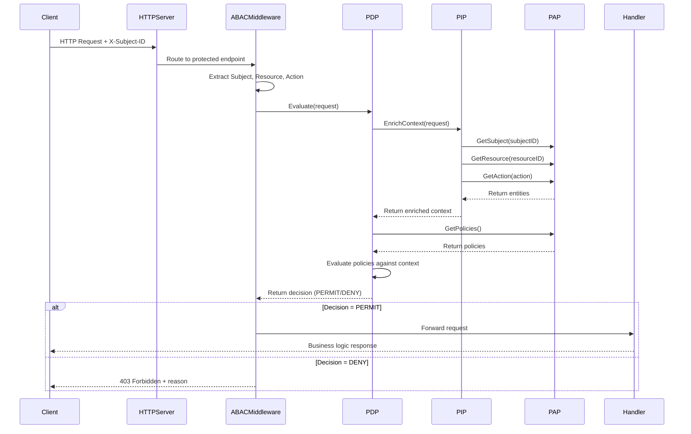

# Code Architecture - ABAC HTTP Service

Tài liệu kiến trúc chi tiết của ABAC HTTP Service đơn giản.

## 🏗️ Tổng Quan Kiến Trúc

### High-Level Architecture

```
┌─────────────────┐    ┌─────────────────┐    ┌─────────────────┐
│   HTTP Client   │───▶│  ABAC Service   │───▶│   Data Layer    │
│                 │    │                 │    │                 │
│ • Web Browser   │    │ • HTTP Server   │    │ • JSON Files    │
│ • Mobile App    │    │ • ABAC Middleware│    │ • Mock Storage  │
│ • API Client    │    │ • REST Endpoints│    │ • Policies      │
└─────────────────┘    └─────────────────┘    └─────────────────┘
```

### ABAC Components Integration

```
HTTP Request
     │
     ▼
┌─────────────────┐
│ HTTP Middleware │ ◄── PEP (Policy Enforcement Point)
│ (ABAC Auth)     │
└─────────┬───────┘
          │
          ▼
┌─────────────────┐
│ Policy Decision │ ◄── PDP (Policy Decision Point)  
│ Point           │
└─────────┬───────┘
          │
          ├─────────────────┐
          │                 │
          ▼                 ▼
┌─────────────────┐ ┌─────────────────┐
│ Attribute       │ │ Policy Admin    │
│ Resolver        │ │ Point           │
│ (PIP)           │ │ (PAP)           │
└─────────────────┘ └─────────────────┘
```

## 📁 Project Structure

```
ABAC-gogo-example/
├── main.go                     # 🚀 HTTP Server + ABAC Middleware
├── go.mod                      # Go modules
├── go.sum                      # Dependencies
│
├── 📊 Data Files (JSON)
│   ├── subjects.json           # Users và attributes
│   ├── resources.json          # API endpoints và properties  
│   ├── actions.json            # Available actions
│   └── policies.json           # ABAC policies và rules
│
├── 📚 Documentation
│   ├── README.md               # Quick start guide
│   ├── API_DOCUMENTATION.md    # API endpoints chi tiết
│   ├── code_architecture.md    # Tài liệu này
│   └── ABAC_SYSTEM_DOCUMENTATION.md
│
└── 🔧 Core Packages
    ├── models/                 # Data structures
    │   ├── types.go           # Core ABAC types
    │   └── types_test.go      # Model tests
    │
    ├── evaluator/             # PDP Implementation
    │   ├── pdp.go            # Policy evaluation engine
    │   └── pdp_test.go       # PDP tests
    │
    ├── attributes/            # PIP Implementation  
    │   ├── resolver.go       # Attribute resolution
    │   └── resolver_test.go  # Attribute tests
    │
    ├── storage/               # PAP Implementation
    │   ├── mock_storage.go   # In-memory mock storage for testing
    │   ├── test_helper.go    # Test utilities
    │   └── postgresql_storage.go # Database storage
    │
    ├── operators/             # Rule Operators
    │   ├── operators.go      # Comparison operators
    │   └── operators_test.go # Operator tests
    │
    ├── audit/                 # Audit Logging
    │   ├── logger.go         # Audit trail
    │   └── logger_test.go    # Audit tests
    │
    └── pep/                   # PEP Components (Legacy)
        ├── core.go           # Advanced PEP features
        ├── middleware.go     # HTTP middleware
        └── ...               # Other PEP components
```

## 🔄 Request Flow Architecture

### 1. HTTP Request Processing



### 2. Component Interaction

```
┌─────────────────────────────────────────────────────────────┐
│                    main.go (HTTP Server)                    │
├─────────────────────────────────────────────────────────────┤
│                                                             │
│  ┌─────────────────┐    ┌─────────────────┐                │
│  │ CORS Middleware │───▶│ ABAC Middleware │                │
│  └─────────────────┘    └─────────┬───────┘                │
│                                   │                        │
│  ┌─────────────────────────────────▼───────────────────┐    │
│  │              ABACService                           │    │
│  │  ┌─────────────────┐  ┌─────────────────┐          │    │
│  │  │       PDP       │  │     Storage     │          │    │
│  │  │   (evaluator)   │  │  (mock/postgres)│          │    │
│  │  └─────────────────┘  └─────────────────┘          │    │
│  └─────────────────────────────────────────────────────┘    │
│                                                             │
│  ┌─────────────────┐  ┌─────────────────┐  ┌─────────────┐  │
│  │ Users Handler   │  │Financial Handler│  │Admin Handler│  │
│  └─────────────────┘  └─────────────────┘  └─────────────┘  │
└─────────────────────────────────────────────────────────────┘
```

## 🧩 Core Components Detail

### 1. HTTP Server (main.go)

**Responsibilities:**
- HTTP server setup và routing
- CORS handling
- Graceful shutdown
- Service initialization

**Key Functions:**
```go
func main()                                    // Server entry point
func (service *ABACService) ABACMiddleware()   // ABAC authorization middleware
func handleUsers()                             // Business logic handlers
func handleFinancialData()
func handleAdminPanel()
```

**Dependencies:**
- `evaluator.PolicyDecisionPoint` (PDP)
- `storage.Storage` (PAP/PIP)

### 2. ABAC Middleware

**Flow:**
```go
func (service *ABACService) ABACMiddleware(requiredAction string) func(http.Handler) http.Handler {
    return func(next http.Handler) http.Handler {
        return http.HandlerFunc(func(w http.ResponseWriter, r *http.Request) {
            // 1. Extract subject từ X-Subject-ID header
            subjectID := r.Header.Get("X-Subject-ID")
            
            // 2. Create evaluation request
            request := &models.EvaluationRequest{
                SubjectID:  subjectID,
                ResourceID: r.URL.Path,        // Resource = URL path
                Action:     requiredAction,    // Action = required permission
                Context:    map[string]interface{}{...}
            }
            
            // 3. Call PDP để evaluate
            decision, err := service.pdp.Evaluate(request)
            
            // 4. Enforce decision
            if decision.Result != "permit" {
                // Return 403 Forbidden
                return
            }
            
            // 5. Allow request to continue
            next.ServeHTTP(w, r)
        })
    }
}
```

### 3. Policy Decision Point (PDP)

**Location:** `evaluator/pdp.go`

**Core Method:**
```go
func (pdp *PolicyDecisionPoint) Evaluate(request *models.EvaluationRequest) (*models.Decision, error) {
    // 1. Enrich context với PIP
    context, err := pdp.attributeResolver.EnrichContext(request)
    
    // 2. Get policies từ PAP
    allPolicies, err := pdp.storage.GetPolicies()
    
    // 3. Filter applicable policies
    applicablePolicies := pdp.filterApplicablePolicies(allPolicies, context)
    
    // 4. Sort by priority
    sort.Slice(applicablePolicies, func(i, j int) bool {
        return applicablePolicies[i].Priority < applicablePolicies[j].Priority
    })
    
    // 5. Evaluate policies với short-circuit logic
    decision := pdp.evaluatePolicies(applicablePolicies, context)
    
    return decision, nil
}
```

**Decision Logic:**
- **DENY overrides everything** - Short circuit nếu có DENY policy match
- **PERMIT requires match** - Cần ít nhất 1 PERMIT policy match
- **NOT_APPLICABLE** - Không có policy nào applicable

### 4. Policy Information Point (PIP)

**Location:** `attributes/resolver.go`

**Core Method:**
```go
func (resolver *AttributeResolver) EnrichContext(request *models.EvaluationRequest) (*models.EvaluationContext, error) {
    // 1. Get subject attributes
    subject, err := resolver.storage.GetSubject(request.SubjectID)
    
    // 2. Get resource attributes  
    resource, err := resolver.storage.GetResource(request.ResourceID)
    
    // 3. Get action attributes
    action, err := resolver.storage.GetAction(request.Action)
    
    // 4. Compute environment attributes
    environment := resolver.computeEnvironmentAttributes(request.Context)
    
    // 5. Return enriched context
    return &models.EvaluationContext{
        Subject:     subject,
        Resource:    resource, 
        Action:      action,
        Environment: environment,
    }, nil
}
```

### 5. Policy Administration Point (PAP)

**Location:** `storage/postgresql_storage.go`

**Key Methods:**
```go
func (s *PostgreSQLStorage) GetSubject(id string) (*models.Subject, error)
func (s *PostgreSQLStorage) GetResource(id string) (*models.Resource, error)  
func (s *PostgreSQLStorage) GetAction(name string) (*models.Action, error)
func (s *PostgreSQLStorage) GetPolicies() ([]*models.Policy, error)
```

**Database Connection:**
```go
func NewPostgreSQLStorage(config *DatabaseConfig) (*PostgreSQLStorage, error) {
    // Load subjects.json → s.subjects map
    // Load resources.json → s.resources map  
    // Load actions.json → s.actions map
    // Load policies.json → s.policies slice
}
```

## 📊 Data Models

### Core ABAC Types

```go
// Evaluation Request
type EvaluationRequest struct {
    RequestID  string                 `json:"request_id"`
    SubjectID  string                 `json:"subject_id"`   // From X-Subject-ID header
    ResourceID string                 `json:"resource_id"`  // From URL path
    Action     string                 `json:"action"`       // Required permission
    Context    map[string]interface{} `json:"context"`      // Additional context
}

// Evaluation Context (Enriched)
type EvaluationContext struct {
    Subject     *Subject               `json:"subject"`
    Resource    *Resource              `json:"resource"`
    Action      *Action                `json:"action"`
    Environment map[string]interface{} `json:"environment"`
    Timestamp   time.Time              `json:"timestamp"`
}

// Decision Result
type Decision struct {
    Result           string   `json:"result"`            // permit/deny/not_applicable
    MatchedPolicies  []string `json:"matched_policies"`  // IDs của policies matched
    EvaluationTimeMs int      `json:"evaluation_time_ms"`
    Reason          string   `json:"reason"`             // Human-readable reason
}
```

### Entity Models

```go
// Subject (User/Service)
type Subject struct {
    ID          string                 `json:"id"`           // sub-001
    ExternalID  string                 `json:"external_id"`  // john.doe@company.com
    SubjectType string                 `json:"subject_type"` // user/service
    Attributes  map[string]interface{} `json:"attributes"`   // department, role, clearance_level
}

// Resource (API Endpoint/Data)
type Resource struct {
    ID           string                 `json:"id"`           // res-001
    ResourceType string                 `json:"resource_type"` // api_endpoint
    ResourceID   string                 `json:"resource_id"`   // /api/v1/users
    Path         string                 `json:"path"`          // api.v1.users
    Attributes   map[string]interface{} `json:"attributes"`    // data_classification, methods
}

// Policy
type Policy struct {
    ID               string        `json:"id"`                // pol-001
    PolicyName       string        `json:"policy_name"`       // Engineering Read Access
    Effect           string        `json:"effect"`            // permit/deny
    Priority         int           `json:"priority"`          // Lower = higher priority
    Enabled          bool          `json:"enabled"`
    Rules            []PolicyRule  `json:"rules"`             // AND logic
    Actions          []string      `json:"actions"`           // Applicable actions
    ResourcePatterns []string      `json:"resource_patterns"` // Resource matching
}

// Policy Rule
type PolicyRule struct {
    TargetType     string      `json:"target_type"`     // subject/resource/action/environment
    AttributePath  string      `json:"attribute_path"`  // attributes.department
    Operator       string      `json:"operator"`        // eq/in/contains/gt/lt
    ExpectedValue  interface{} `json:"expected_value"`  // "engineering"
    IsNegative     bool        `json:"is_negative"`     // NOT logic
}
```

## 🔧 Configuration & Deployment

### Environment Setup

```bash
# Development
go run main.go

# Production Build
go build -o abac-service main.go
./abac-service

# Docker
docker build -t abac-service .
docker run -p 8081:8081 abac-service
```

### Configuration Files

**subjects.json** - User definitions
```json
{
  "subjects": [
    {
      "id": "sub-001",
      "external_id": "john.doe@company.com", 
      "subject_type": "user",
      "attributes": {
        "department": "engineering",
        "role": ["senior_developer"],
        "clearance_level": 3
      }
    }
  ]
}
```

**resources.json** - API endpoint definitions
```json
{
  "resources": [
    {
      "id": "res-001",
      "resource_type": "api_endpoint",
      "resource_id": "/api/v1/users",
      "attributes": {
        "data_classification": "internal",
        "methods": ["GET", "POST"]
      }
    }
  ]
}
```

**policies.json** - ABAC rules
```json
{
  "policies": [
    {
      "id": "pol-001",
      "policy_name": "Engineering Read Access",
      "effect": "permit",
      "priority": 100,
      "enabled": true,
      "rules": [
        {
          "target_type": "subject",
          "attribute_path": "attributes.department", 
          "operator": "eq",
          "expected_value": "engineering"
        }
      ],
      "actions": ["read"],
      "resource_patterns": ["/api/v1/*"]
    }
  ]
}
```

## 🚀 Performance & Scalability

### Current Performance
- **In-memory storage** - O(1) lookups cho subjects/resources
- **Policy evaluation** - O(n) với n = số policies
- **No caching** - Mỗi request đều evaluate từ đầu
- **Single-threaded** - Không có concurrent processing

### Optimization Opportunities
1. **Decision Caching** - Cache ABAC decisions với TTL
2. **Policy Indexing** - Index policies theo resource patterns
3. **Concurrent Evaluation** - Parallel policy evaluation
4. **Database Storage** - PostgreSQL thay vì JSON files
5. **Connection Pooling** - Database connection management

### Scalability Considerations
- **Horizontal Scaling** - Stateless service, có thể scale horizontally
- **Load Balancing** - Multiple instances behind load balancer
- **Database Scaling** - Read replicas cho policy data
- **Caching Layer** - Redis cho decision caching
- **Monitoring** - Metrics và alerting cho performance

## 🔍 Testing Strategy

### Unit Tests
- **Models** - Data structure validation
- **PDP** - Policy evaluation logic
- **PIP** - Attribute resolution
- **PAP** - Storage operations
- **Operators** - Rule evaluation

### Integration Tests  
- **HTTP Endpoints** - End-to-end API testing
- **ABAC Flow** - Complete authorization flow
- **Error Handling** - Error scenarios và edge cases

### Performance Tests
- **Load Testing** - Concurrent request handling
- **Stress Testing** - High volume scenarios
- **Latency Testing** - Response time measurement

## 📈 Monitoring & Observability

### Logging
```go
log.Printf("ABAC Decision: %s - Subject: %s, Resource: %s, Action: %s, Reason: %s",
    decision.Result, subjectID, r.URL.Path, requiredAction, decision.Reason)
```

### Metrics (Future)
- Request count per endpoint
- ABAC decision distribution (permit/deny/not_applicable)
- Evaluation latency
- Error rates
- Policy match statistics

### Health Checks
- `/health` endpoint cho service health
- Database connectivity checks
- Policy loading validation