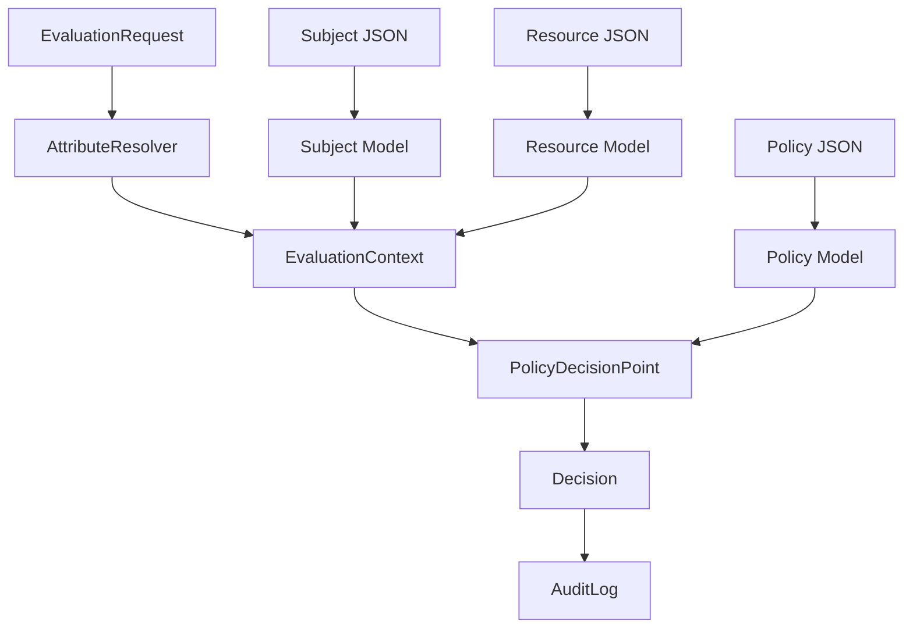

# Models Package - Data Structures & Types

## 📋 Tổng Quan

Package `models` chứa tất cả các data structures và types cốt lõi của hệ thống ABAC với **GORM support** cho PostgreSQL database. Đây là foundation layer định nghĩa cách data được organize, structured, và persisted trong toàn bộ hệ thống.

## 🏗️ Trách Nhiệm Chính

1. **Data Model Definition**: Định nghĩa cấu trúc dữ liệu cho tất cả entities
2. **GORM Integration**: Support PostgreSQL database với GORM tags
3. **JSONB Support**: Custom types cho PostgreSQL JSONB storage
4. **Type Safety**: Đảm bảo type safety cho toàn bộ hệ thống
5. **JSON Serialization**: Support marshal/unmarshal JSON data
6. **Database Migration**: Auto-migration support với proper indexes
7. **Validation**: Implicit validation thông qua struct tags

## 📁 Cấu Trúc Files

```
models/
├── types.go          # Core data structures
└── types_test.go     # Unit tests cho models
```

## 🔍 Chi Tiết Các Models

### 0. Custom JSONB Types

**Mục đích**: Support PostgreSQL JSONB storage cho complex Go data structures

```go
// JSONMap - Custom type cho map[string]interface{} → PostgreSQL JSONB
type JSONMap map[string]interface{}

func (j JSONMap) Value() (driver.Value, error) {
    return json.Marshal(j)
}

func (j *JSONMap) Scan(value interface{}) error {
    bytes, ok := value.([]byte)
    if !ok {
        return errors.New("type assertion to []byte failed")
    }
    return json.Unmarshal(bytes, &j)
}

// JSONStringSlice - Custom type cho []string → PostgreSQL JSONB  
type JSONStringSlice []string

// JSONPolicyRules - Custom type cho []PolicyRule → PostgreSQL JSONB
type JSONPolicyRules []PolicyRule
```

**GORM Integration:**
- Implement `driver.Valuer` interface cho write operations
- Implement `sql.Scanner` interface cho read operations
- Automatic JSON marshaling/unmarshaling
- PostgreSQL JSONB indexing support với GIN indexes

### 1. Subject Model với GORM Tags

**Mục đích**: Đại diện cho user, service, hoặc application cần access resources

```go
type Subject struct {
    ID          string    `json:"id" gorm:"primaryKey;size:255"`
    ExternalID  string    `json:"external_id" gorm:"size:255;index"`
    SubjectType string    `json:"subject_type" gorm:"size:100;not null;index"`
    Metadata    JSONMap   `json:"metadata" gorm:"type:jsonb"`
    Attributes  JSONMap   `json:"attributes" gorm:"type:jsonb"`
    CreatedAt   time.Time `json:"created_at,omitempty" gorm:"autoCreateTime"`
    UpdatedAt   time.Time `json:"updated_at,omitempty" gorm:"autoUpdateTime"`
}
```

**GORM Tags Explained:**
- `primaryKey`: Defines primary key
- `size:255`: Sets VARCHAR length limit
- `index`: Creates database index cho performance
- `type:jsonb`: Uses PostgreSQL JSONB data type
- `autoCreateTime/autoUpdateTime`: Auto-managed timestamps

**Field Chi Tiết:**

- **ID**: Primary key, format `sub-XXX`
- **ExternalID**: Human-readable identifier (email cho user, service name cho service)
- **SubjectType**: Phân loại subject type để apply different policies
- **Metadata**: Thông tin display (full_name, email, description) - không dùng cho policy evaluation
- **Attributes**: Core attributes dùng cho policy evaluation (department, role, clearance_level, etc.)

**Subject Types:**
- `user`: Human users (employees, contractors)
- `service`: Internal services (APIs, microservices)  
- `application`: External applications (mobile apps, web apps)

**Common Attributes:**
```json
{
  "department": "engineering|finance|hr|marketing",
  "role": ["senior_developer", "code_reviewer", "team_lead"],
  "clearance_level": 1-5,
  "location": "VN-HCM|VN-HN|VN-DN",
  "team": "platform|frontend|backend|devops",
  "years_of_service": 0-50,
  "on_probation": true|false,
  "manager_id": "sub-XXX"
}
```

### 2. Resource Model

**Mục đích**: Đại diện cho tài nguyên cần được bảo vệ (APIs, databases, documents, etc.)

```go
type Resource struct {
    ID           string                 `json:"id"`            // Unique identifier
    ResourceType string                 `json:"resource_type"` // Category of resource
    ResourceID   string                 `json:"resource_id"`   // Business identifier
    Path         string                 `json:"path"`          // Hierarchical path
    ParentID     string                 `json:"parent_id,omitempty"` // Parent resource
    Metadata     map[string]interface{} `json:"metadata"`      // Display information
    Attributes   map[string]interface{} `json:"attributes"`    // Policy attributes
    CreatedAt    time.Time              `json:"created_at,omitempty"`
}
```

**Field Chi Tiết:**

- **ID**: Primary key, format `res-XXX`
- **ResourceType**: Category để group similar resources
- **ResourceID**: Business identifier (API path, database name, document ID)
- **Path**: Hierarchical path cho inheritance và pattern matching
- **ParentID**: Support resource hierarchy (folder → document)
- **Attributes**: Policy evaluation attributes (data_classification, environment, etc.)

**Resource Types:**
- `api_endpoint`: REST APIs, GraphQL endpoints
- `database`: SQL/NoSQL databases, tables
- `document`: Files, reports, documents
- `kubernetes_namespace`: K8s resources
- `storage_bucket`: Cloud storage buckets

**Common Attributes:**
```json
{
  "data_classification": "public|internal|confidential|highly_confidential",
  "environment": "development|staging|production",
  "pii_data": true|false,
  "encryption": "none|AES-128|AES-256",
  "backup_enabled": true|false,
  "region": "ap-southeast-1|us-west-2",
  "department": "engineering|finance|hr"
}
```

### 3. Action Model

**Mục đích**: Định nghĩa các operations có thể thực hiện trên resources

```go
type Action struct {
    ID             string `json:"id"`              // Unique identifier
    ActionName     string `json:"action_name"`     // Operation name
    ActionCategory string `json:"action_category"` // Category grouping
    Description    string `json:"description"`     // Human description
    IsSystem       bool   `json:"is_system"`       // System vs user action
}
```

**Field Chi Tiết:**

- **ID**: Primary key, format `act-XXX`
- **ActionName**: Standard operation name (read, write, delete, execute)
- **ActionCategory**: Group related actions
- **IsSystem**: Distinguish system operations vs user operations

**Action Categories:**
- `crud`: Create, Read, Update, Delete operations
- `system`: System-level operations (execute, deploy)
- `workflow`: Business workflow operations (approve, reject)
- `deployment`: Deployment operations (deploy, rollback)

**Standard Actions:**
```json
[
  {"action_name": "read", "action_category": "crud"},
  {"action_name": "write", "action_category": "crud"},
  {"action_name": "delete", "action_category": "crud"},
  {"action_name": "execute", "action_category": "system"},
  {"action_name": "approve", "action_category": "workflow"},
  {"action_name": "deploy", "action_category": "deployment"}
]
```

### 4. Policy Model

**Mục đích**: Định nghĩa access control rules và logic

```go
type Policy struct {
    ID               string                 `json:"id"`               // Unique identifier
    PolicyName       string                 `json:"policy_name"`      // Human-readable name
    Description      string                 `json:"description"`      // Policy purpose
    Effect           string                 `json:"effect"`           // "permit" | "deny"
    Priority         int                    `json:"priority"`         // Evaluation order
    Enabled          bool                   `json:"enabled"`          // Active status
    Version          int                    `json:"version"`          // Version control
    Conditions       map[string]interface{} `json:"conditions"`       // Legacy conditions
    Rules            []PolicyRule           `json:"rules"`            // Evaluation rules
    Actions          []string               `json:"actions"`          // Applicable actions
    ResourcePatterns []string               `json:"resource_patterns"` // Resource filters
    CreatedAt        time.Time              `json:"created_at,omitempty"`
    UpdatedAt        time.Time              `json:"updated_at,omitempty"`
}
```

**Field Chi Tiết:**

- **Effect**: `permit` (allow access) hoặc `deny` (block access)
- **Priority**: Lower number = higher priority (1-1000)
- **Rules**: Array of conditions, tất cả phải match (AND logic)
- **Actions**: Whitelist of applicable actions (`["read", "write"]` hoặc `["*"]`)
- **ResourcePatterns**: Wildcard patterns cho resource matching

**Policy Effects:**
- `permit`: Grant access nếu tất cả rules match
- `deny`: Block access nếu tất cả rules match (override permit)

**Priority Ranges:**
- `1-10`: Critical deny policies (security violations)
- `11-50`: High priority policies (role-based access)
- `51-100`: Standard policies (department access)
- `101-1000`: Low priority policies (default permissions)

### 5. PolicyRule Model

**Mục đích**: Định nghĩa individual condition trong policy

```go
type PolicyRule struct {
    ID            string      `json:"id,omitempty"`       // Optional rule ID
    TargetType    string      `json:"target_type"`        // "subject|resource|action|environment"
    AttributePath string      `json:"attribute_path"`     // Dot notation path
    Operator      string      `json:"operator"`           // Comparison operator
    ExpectedValue interface{} `json:"expected_value"`     // Expected value
    IsNegative    bool        `json:"is_negative,omitempty"` // Negate result
    RuleOrder     int         `json:"rule_order,omitempty"`  // Rule evaluation order
}
```

**Field Chi Tiết:**

- **TargetType**: Specify nguồn data cho comparison
- **AttributePath**: Dot notation để access nested attributes
- **Operator**: Comparison method (eq, in, contains, regex, etc.)
- **ExpectedValue**: Value để compare against
- **IsNegative**: Negate kết quả comparison (NOT logic)

**Target Types:**
- `subject`: Access subject attributes (`attributes.department`)
- `resource`: Access resource attributes (`attributes.data_classification`)
- `action`: Access action properties (`action_name`, `action_category`)
- `environment`: Access runtime context (`time_of_day`, `source_ip`)

**Attribute Path Examples:**
```json
{
  "subject": [
    "attributes.department",
    "attributes.role",
    "subject_type",
    "metadata.employee_id"
  ],
  "resource": [
    "attributes.data_classification",
    "resource_type",
    "path",
    "metadata.created_by"
  ],
  "environment": [
    "time_of_day",
    "source_ip",
    "is_business_hours",
    "day_of_week"
  ]
}
```

### 6. EvaluationRequest Model

**Mục đích**: Input cho policy evaluation process

```go
type EvaluationRequest struct {
    RequestID  string                 `json:"request_id"`  // Unique request identifier
    SubjectID  string                 `json:"subject_id"`  // Who is requesting
    ResourceID string                 `json:"resource_id"` // What resource
    Action     string                 `json:"action"`      // What action
    Context    map[string]interface{} `json:"context"`     // Runtime context
}
```

**Field Chi Tiết:**

- **RequestID**: Unique identifier cho audit trail
- **SubjectID**: Reference đến Subject entity
- **ResourceID**: Reference đến Resource entity  
- **Action**: Action name (not ID)
- **Context**: Runtime environment data

**Context Fields:**
```json
{
  "timestamp": "2024-01-15T14:00:00Z",
  "source_ip": "10.0.1.50",
  "user_agent": "Mozilla/5.0...",
  "session_id": "sess-12345",
  "request_method": "GET|POST|PUT|DELETE",
  "api_version": "v1|v2"
}
```

### 7. EvaluationContext Model

**Mục đích**: Enriched context cho policy evaluation

```go
type EvaluationContext struct {
    Subject     *Subject                   // Full subject object
    Resource    *Resource                  // Full resource object
    Action      *Action                    // Full action object
    Environment map[string]interface{}     // Enriched environment
    Timestamp   time.Time                  // Evaluation timestamp
}
```

**Enrichment Process:**
1. Resolve IDs thành full objects
2. Add computed environment attributes
3. Add dynamic subject attributes
4. Validate data completeness

### 8. Decision Model

**Mục đích**: Output của policy evaluation

```go
type Decision struct {
    Result           string   `json:"result"`            // "permit|deny|not_applicable"
    MatchedPolicies  []string `json:"matched_policies"`  // List of matched policy IDs
    EvaluationTimeMs int      `json:"evaluation_time_ms"` // Performance metric
    Reason           string   `json:"reason,omitempty"`   // Human explanation
}
```

**Decision Results:**
- `permit`: Access granted
- `deny`: Access blocked
- `not_applicable`: No policies matched

### 9. AuditLog Model

**Mục đích**: Audit trail cho compliance và debugging

```go
type AuditLog struct {
    ID           int64                  `json:"id"`            // Auto-increment ID
    RequestID    string                 `json:"request_id"`    // Link to request
    SubjectID    string                 `json:"subject_id"`    // Who
    ResourceID   string                 `json:"resource_id"`   // What
    ActionID     string                 `json:"action_id"`     // How
    Decision     string                 `json:"decision"`      // Result
    EvaluationMs int                    `json:"evaluation_ms"` // Performance
    Context      map[string]interface{} `json:"context"`       // Full context
    CreatedAt    time.Time              `json:"created_at"`    // When
}
```

## 🔄 Data Flow



## 🎯 Design Principles

1. **Immutability**: Models are read-only sau khi creation
2. **Type Safety**: Strong typing với clear field types
3. **JSON Compatibility**: Full JSON marshal/unmarshal support
4. **Extensibility**: Map fields cho custom attributes
5. **Performance**: Minimal memory footprint
6. **Clarity**: Self-documenting field names

## 🧪 Testing

```go
// Example model validation test
func TestSubjectModel(t *testing.T) {
    subject := &models.Subject{
        ID:          "sub-001",
        ExternalID:  "john.doe@company.com",
        SubjectType: "user",
        Attributes: map[string]interface{}{
            "department": "engineering",
            "role":       []string{"senior_developer"},
        },
    }
    
    // Test JSON serialization
    data, err := json.Marshal(subject)
    assert.NoError(t, err)
    
    // Test JSON deserialization
    var decoded models.Subject
    err = json.Unmarshal(data, &decoded)
    assert.NoError(t, err)
    assert.Equal(t, subject.ID, decoded.ID)
}
```

## 📝 Best Practices

1. **Attribute Naming**: Use snake_case cho attribute keys
2. **Type Consistency**: Maintain consistent types across similar attributes
3. **Validation**: Validate required fields before processing
4. **Documentation**: Document custom attributes trong comments
5. **Versioning**: Use Version field cho policy evolution

## 🔍 Common Patterns

### Hierarchical Resources
```json
{
  "id": "res-001",
  "resource_type": "document",
  "path": "/company/finance/reports/2024/q1.pdf",
  "parent_id": "res-parent-folder"
}
```

### Multi-Value Attributes
```json
{
  "attributes": {
    "role": ["senior_developer", "code_reviewer", "team_lead"],
    "permissions": ["read", "write", "approve"]
  }
}
```

### Temporal Attributes
```json
{
  "attributes": {
    "valid_from": "2024-01-01T00:00:00Z",
    "valid_until": "2024-12-31T23:59:59Z",
    "hire_date": "2020-01-15"
  }
}
```

Package `models` là foundation của toàn bộ hệ thống ABAC, cung cấp type-safe data structures và clear contracts cho tất cả components khác.
